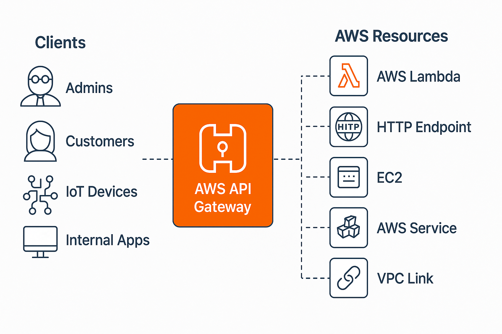

This guide walks you through everything from routing and stage management to Lambda proxies, VPC links, and CORS.

## What Is AWS API Gateway?

**AWS API Gateway** is a fully managed service that allows you to define, secure, monitor, and route HTTP(S) requests to backend services like:

* AWS Lambda functions
    
* Internal microservices over VPC links
    
* External URLs or legacy systems
    



You can think of it as:

> *A programmable front door to your APIs, with built-in security, throttling, routing, logging, and environment separation.*

## Understanding Resources

In API Gateway, **resources** are like RESTful paths. Think of it as a skeleton for your API Gateway’s Route Paths:

* `/users`
    
* `/users/{userId}`
    
* `/orders/{orderId}`
    

Each resource can have multiple **HTTP methods** (GET, POST, PUT, etc.) defined independently.

Resources allow you to:

* Define **proxy paths** (`{proxy+}`) for catch-all routing
    
* Attach different integrations (Lambda, VPC, mock) to different methods
    
* Enable features like CORS per route
    

## Stages: dev, staging, uat, prod

**Stages** are deployable versions of your API:

* Each stage is tied to a **deployment snapshot**
    
* URLs are prefixed with the stage name:  
    [`https://abc123.execute-api.us-east-1.amazonaws.com/dev`](https://abc123.execute-api.us-east-1.amazonaws.com/dev)
    

Stages let you:

* Deploy to **isolated environments** (dev, prod)
    
* Attach different **logging levels**
    
* Configure **stage variables** for dynamic routing
    

## Authorizers

Authorizers let you **secure endpoints** by validating tokens or identity headers before passing requests to your backend.

### Types:

* **Lambda Authorizer**: custom logic (e.g., JWT parsing, RBAC)
    
* **Cognito Authorizer**: native integration with AWS Cognito user pools
    

You can attach authorizers to:

* Specific HTTP methods
    
* All routes under a resource (via inheritance)
    

This helps enforce identity-aware access control without modifying backend code.

## API Keys

API Keys in API Gateway are **identifiers for clients** — used mainly for:

* **Throttling individual clients**
    
* **Monitoring usage per key**
    
* **Enforcing quota limits**
    

They are **not a security mechanism** (like OAuth or JWT). They're passed via the `x-api-key` header and must be tied to a **Usage Plan** to take effect.

## Usage Plans

**Usage Plans** define:

* Rate limits (requests per second)
    
* Burst limits (temporary spikes)
    
* Quota (total requests per day/week/month)
    

You associate:

* One or more **API Keys**
    
* One or more **stages**
    
* Optional throttling and quota
    

This lets you manage free-tier access, premium clients, or internal vs public access from a single control plane.

## Binding Lambda to Resource Routes (Proxy vs Non-Proxy)

### Proxy Integration (AWS\_PROXY)

* Sends the **entire HTTP request as-is** to your Lambda function
    
* Lambda receives event with:
    
    * Headers, method, path, body, etc.
        

> Ideal for backend-for-frontend use cases or single-function APIs

### Non-Proxy Integration

* You must **manually map** request fields (method, body, query, etc.)
    
* Allows **fine-grained control** but adds complexity
    

> Use this when your backend expects a specific format or when integrating with legacy systems.

## Binding VPC Link to Resource Routes (Proxy vs Non-Proxy)

Use **VPC Link** to expose internal services running in private subnets (behind an NLB).

### Proxy Integration (HTTP\_PROXY)

* Entire request is forwarded “as-is” to your internal service
    
* Simplest option, minimal config
    

### Non-Proxy Integration

* Define request templates to transform data before forwarding
    
* Useful when bridging REST to legacy backends that expect specific formats
    

## Enabling CORS (Cross-Origin Resource Sharing)

CORS is required when:

* Your frontend (e.g., hosted on [`example.com`](http://example.com)) accesses an API on a different domain (e.g., [`api.example.com`](http://api.example.com))
    

### To enable CORS:

* Add an **OPTIONS** method to each route
    
* Return headers like:
    
    * `Access-Control-Allow-Origin`
        
    * `Access-Control-Allow-Methods`
        
    * `Access-Control-Allow-Headers`
        

> You can enable this manually or use the console's **Enable CORS** feature — but make sure your responses **return these headers dynamically**, especially in error cases.

## Stage Variables

**Stage Variables** act like environment variables for API Gateway.

Use them to:

* Switch between Lambda aliases (`dev`, `prod`)
    
* Configure endpoint URLs (for VPC links)
    
* Inject environment-specific logic into integrations
    

They’re accessible in:

* Integration targets as `${stageVariables.<name>}`
    
* Mapping Values as `stageVariables.<name>`
    

## Using Stage Variables for Proxy+ VPC Link Routing

One powerful trick:

> Use a **proxy route** like `/internal/{proxy+}` and bind it to different **VPC endpoints** using stage variables.

Example:

```plaintext
Integration URI: http://${stageVariables.vpcEndpoint}/{proxy}
```

Each stage (`dev`, `prod`, etc.) defines a different `vpcEndpoint` variable.

This makes things —

* Clean
    
* Environment-aware
    
* No code duplication
    

## Conclusion

AWS API Gateway is incredibly flexible but only if you understand how its building blocks work together.

This post covers:

* Routing with Lambda or VPC
    
* Security with Authorizers and API keys
    
* Flexibility with Stage Variables
    
* Browser Integration via CORS
    

Want to see this in action with real configs or Terraform/CDK examples? **Drop your questions in the comments — let’s build it out together.**
