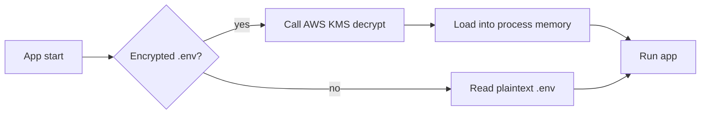

This is a demo fixture used to verify code highlighting and Mermaid rendering. Replace with real content.

## A code block

```js
import { KMS } from "@aws-sdk/client-kms";

const kms = new KMS({ region: "ap-south-1" });

export async function decryptEnv(ciphertext) {
  const { Plaintext } = await kms.decrypt({
    CiphertextBlob: Buffer.from(ciphertext, "base64"),
  });
  return Buffer.from(Plaintext).toString("utf-8");
}
```

## A Mermaid diagram



That's it — both should render correctly after build.
