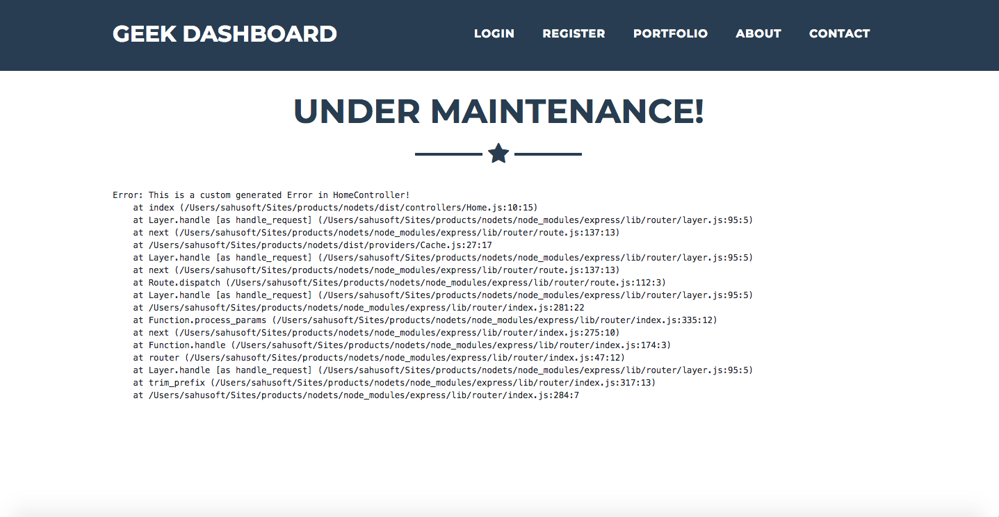
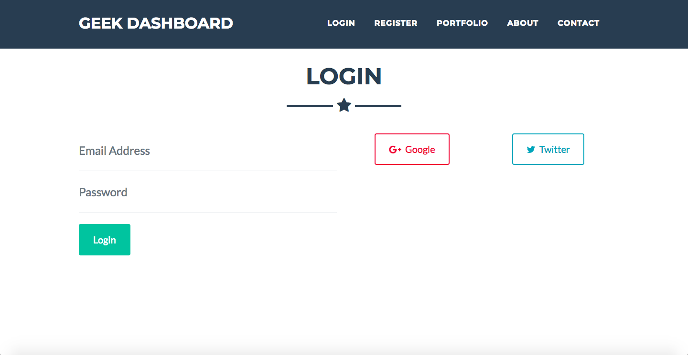
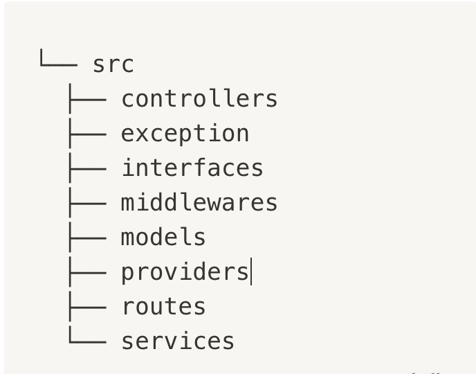
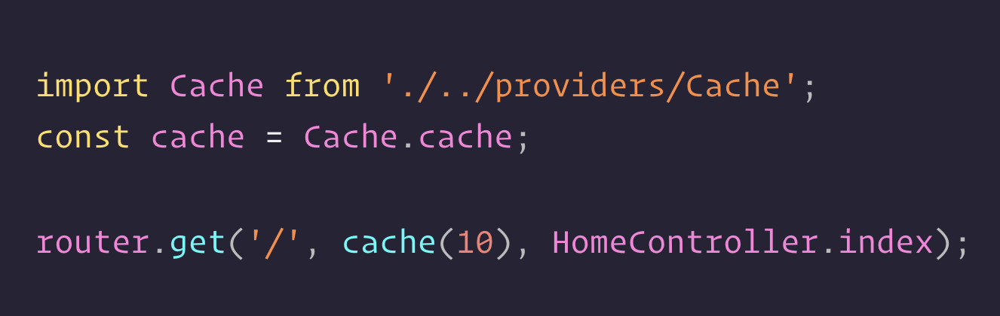

**In ExpressJS**, we always have to start from scratch for things like *CSRF*/*JWT Token*, *Exception Handling*, *Clusters*, *Queues*, *Cache*, etc. So, I thought to make a boilerplate to kick start with technologies like *Typescript*, *MongoDB* and *Pug Template*.

You can find the repository on GitHub — [geekyants/express-typescript](https://github.com/GeekyAnts/express-typescript).

# Features:

## #1. Exception Handling

) Rather than sending the entire load onto a single Core / CPU, we try to take advantage of a multi-core system to handle the load. Here, if the cluster dies due to some reason, we create / fork a new one immediately.

## #3. Authentication (E-Mail with OAuth)

) A Single Log class with methods like info, warn, error & custom.

These methods send the log string to a file under <YYYY-MM-DD>.log directory of your project root and keep creating these log files daily rather than having a single log file.

You can zip them every week too!

## #5. DotEnv

Use of **.env** file, to load environment variables/constants for the entire app. So now, we have a single centralized constants location.

## #6. Tokens

We prefer using CSRF token (stateful) for our Web routes whereas JWT token (stateless) for the API routes. So, here we create middlewares for both the tokens and registered them against Web and API routes respectively.

## #7. Structure

)
There are various things in backend logic that do not really need to happen onto the request.

Things like sending out E-Mails or SMS texts, etc. So basically, things that require a connection to any third party service.

For this, I have used [KueJS](https://github.com/Automattic/kue), a priority-based job queue that runs on a Redis driver.

## #9. Cache

) cache using memory-cache.

And many more…

- - -
