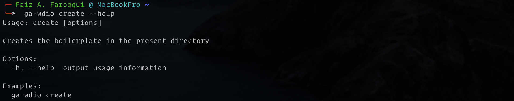
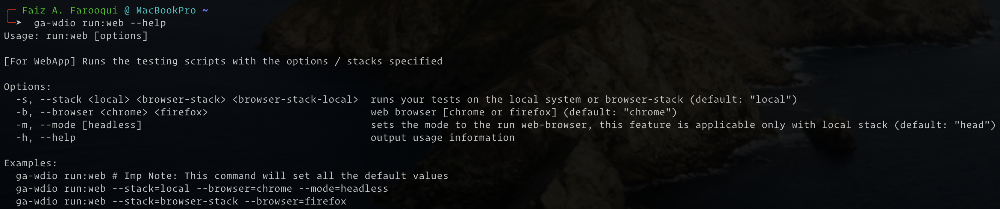
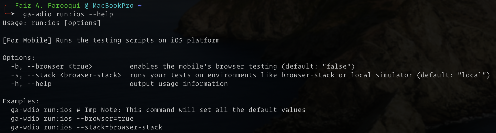
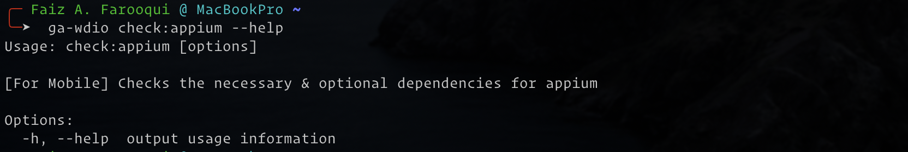

GA-WDIO is an automation testing CLI tool, that supports WebDriverIO and provides solutions to our in-house issues.

GA-WDIO manages things like set-up, configurations, drivers, etc. internally for the Web, API & Mobile apps.

You can find the repository on GitHub — [geekyants/ga-wdio](https://github.com/GeekyAnts/ga-wdio).

Or

You can find the npm package on NPM - [ga-wdio](https://www.npmjs.com/package/ga-wdio)

Or

You can install the package locally using the following command:
```sh
npm install -g ga-wdio
```


# Why we need this tool?

**Web** automation testing requires things like *selenium driver*, *browser’s driver*, *configuration files* for *different browsers* and platforms.

**API** testing mostly was done on *Postman* and we always needed something with *state-management* to reuse the response from an API to the other one’s request.


**Mobile** automation testing always had to go with configuring the *Appium* and running it before we run our test cases.

Once all the things were correctly configured, the developer will then focus on **creating the app structure and writing those test cases**.

So in all, writing test cases were never a pain but **setting up** one & then **configuring** it has always made our team avoid writing automation testing!

# What does this tool provide?

1. Support for:

  - Web App Testing
  - API Testing
  - iOS & Android Mobile App Testing
  - iOS & Android Mobile Browser Testing
  - [Browser Stack’s Automate](https://www.browserstack.com/automate) environment for Web & Mobile Testing

2. CLI commands to:

  - Create boilerplate.
  - Run test cases.
  - Check the Appium’s necessary & optional dependencies on your system
  - Upload the mobile APK or IPA to the browser-stack cloud.

# What are the commands? How do they work?

- **Create Command** for All — It asks you various questions before creating the boilerplate!

)

- **Run Command** — Web

)

- **Run Command** — iOS Mobile

)

)

- - -
