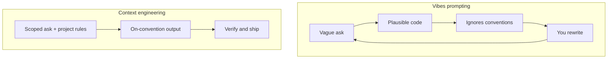
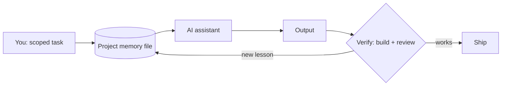

The last post in this series was about what *not* to feed an AI:
[keep your secrets out of the prompt](/using-ai-without-leaking-secrets). This one is
the other half of the same coin. Once you're using AI safely, how do you use it so it
actually multiplies your output instead of generating confident, plausible garbage you
spend the afternoon unwinding?

After a lot of shipping with these tools, my conclusion is boring but load-bearing: the
gap between "AI helps" and "AI hurts" is almost never the model. It's the *context* you
give it. The skill that matters isn't writing a clever prompt. It's engineering the
context so the obvious prompt produces the right answer.

## The failure mode: vibes-based prompting

Here's the loop most people are stuck in. You ask for something in a sentence, you get
back code that looks right, and then you notice it used a library you don't use, named
things against your conventions, and re-introduced a bug you fixed last week. So you
rewrite it, and the next task starts from zero again.

An AI with no context is a sharp junior who has never read your codebase and remembers
nothing from yesterday. You wouldn't hand that person a one-line ticket and expect a
mergeable PR. The fix isn't a smarter junior. It's an onboarding doc.

## Context engineering: a project memory file

The single highest-leverage thing I do is keep a project memory file in the repo, the
kind most agentic tools now read automatically. It is the onboarding doc, except the
new hire reads it perfectly every single time.

What goes in it isn't generic style advice. It's the hard-won, project-specific stuff
that an outsider could not guess. A few representative entries from this very site,
abbreviated:

- **Non-negotiables.** Canonical URLs always point at the production host; post slugs
  must match the live URLs exactly, because changing one breaks a ranked page.
- **Computed, never hardcoded.** Years of experience is derived from a start date in
  one config, never written as a literal number anywhere.
- **The gotchas that cost an afternoon.** One edge setting at the CDN must stay off or
  it silently breaks the JavaScript; the content config has to live at one exact path
  or the framework rejects it.

Every line in that file is a mistake that happened once and is now structurally
prevented from happening again. That's the real point: the file is a *compounding
asset*. The repo teaches the assistant, so I stop re-explaining the same five things,
and the quality of the first draft climbs over time instead of resetting each session.

The loop that matters is the dotted-back edge: when the model gets something wrong in a
way that will recur, the fix isn't just correcting this output. It's adding a line to
the context file so the whole class of mistake is gone.

## Meta-prompting: point the AI at its own instructions

The second habit is using the AI on its *own* setup. A few moves I lean on:

- **Bootstrap the context file from the code.** Ask the model to read the project and
  draft the memory file, then edit it down. It's faster at inventorying conventions than
  I am, and I keep the judgment.
- **Make it restate the task first.** For anything non-trivial, I ask it to summarize
  what it's about to do before it does it. Half the bad outputs die right there, in the
  restatement, before any code is written.
- **Ask it to improve the prompt.** "What's ambiguous about what I just asked?" is often
  more useful than the answer to the original question.

None of this is tied to a particular product. I move between an agentic CLI in the
terminal, a browser chat for one-off questions and rubber-ducking, and inline editor
completions, depending on the task. The tools change every few months. The principle,
which is that you engineer context and make the implicit explicit, does not.

## Where it helps, and where it doesn't

Being honest about the boundary is what keeps this from becoming hype. The tools are a
force multiplier on some work and a liability on the rest.

| Reach for AI | Keep it human |
| --- | --- |
| Boilerplate and scaffolding | Novel architecture decisions |
| Pattern-following refactors | Taste and product calls |
| Explaining unfamiliar code | Anything where confidently wrong is expensive |
| Mechanical sweeps across a repo | Security-critical design |
| Test and fixture scaffolding | The final review before it ships |

The mechanical-sweep row is not hypothetical. The cleanup that removed a particular
punctuation mark from every page of this site, touched across a dozen files in minutes,
is exactly the kind of tedious, well-specified, low-judgment work these tools are built
for. The architecture of the site is not.

## The workflow loop

The discipline that ties it together is small and unglamorous:

1. **Scope the task small.** One change with a clear definition of done, not "build the
   feature."
2. **Give it the context up front**, or trust the memory file to.
3. **Verify every output.** Run the build, open the preview, read the diff. The
   four-second answer still has to pass the same bar your own code does.
4. **Review it like a junior's PR**, because that's what it is. This is the same habit
   from the [secrets post](/using-ai-without-leaking-secrets): nothing the model
   produces lands in a commit, a log, or a PR until a human has read it.
5. **Feed lessons back** into the context file so the next draft starts higher.

I wrote about the [whole build of this site](/building-this-blog-astro-cloudflare-umami)
elsewhere; a good chunk of it ran through exactly this loop.

## The payoff

The leverage was never in the prompt I typed. It's in the context I maintain. A
well-instrumented repo, with its conventions and scars written down where the tool can
read them, turns an AI from a generator of plausible code into something that ships work
that actually fits.

And notice that the secure workflow from the last post and the high-output workflow from
this one are the same workflow. Scoping tightly, keeping secrets out, reviewing every
output, writing down what matters: that discipline is what makes AI both safe and worth
using. Play nice, play safe, ship more.
