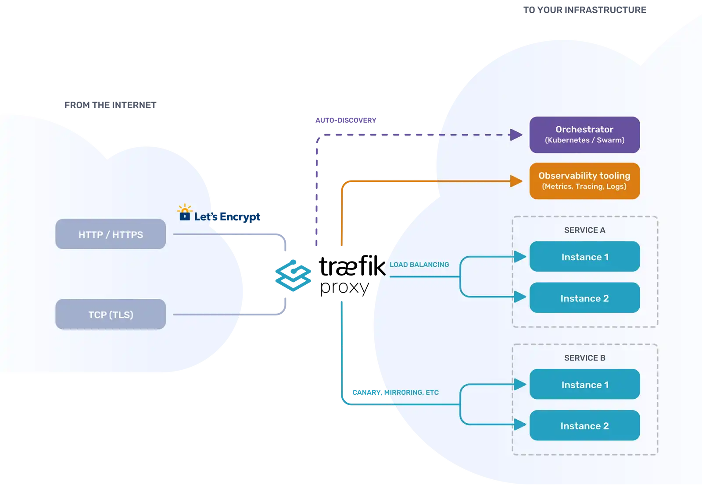
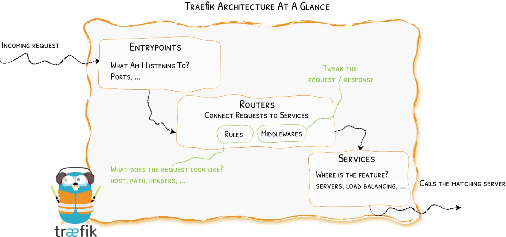
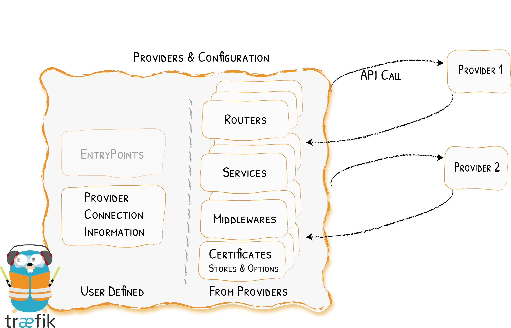
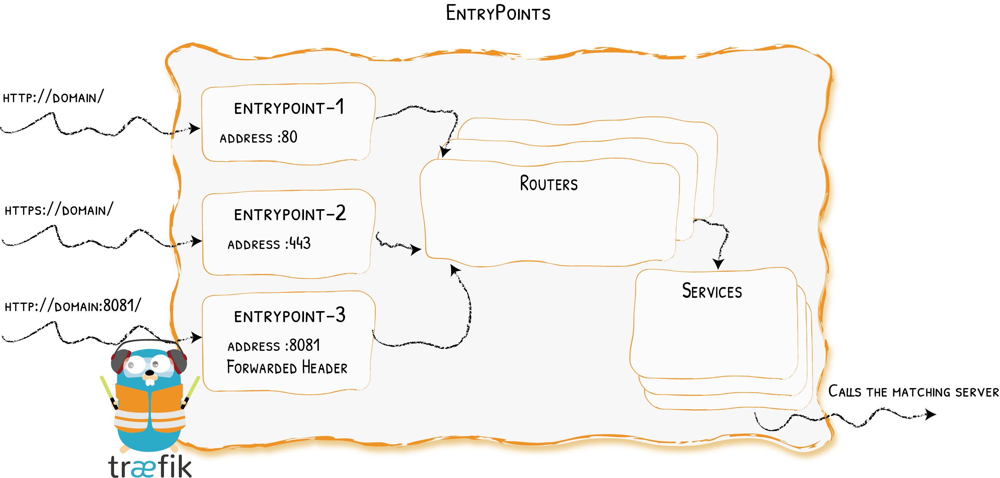
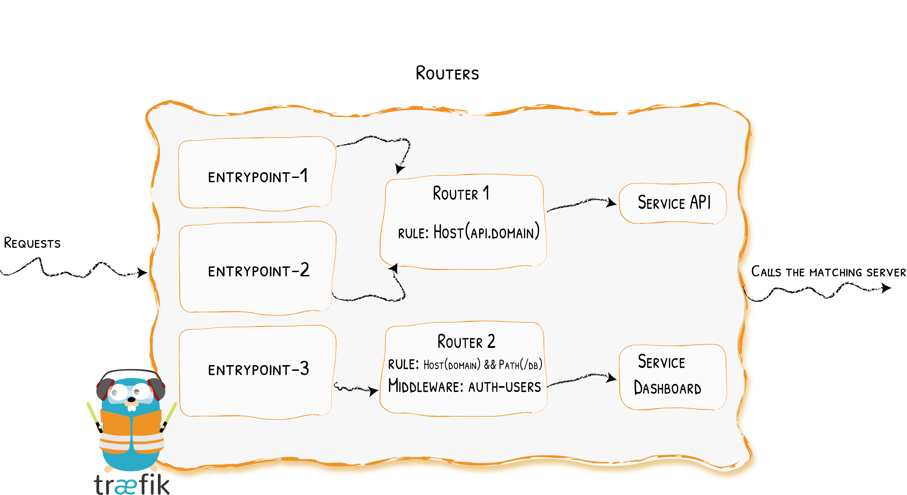
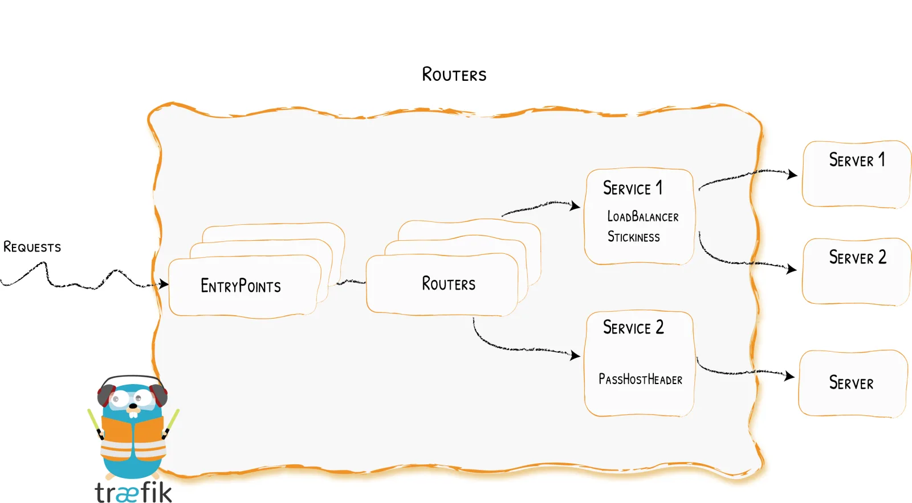
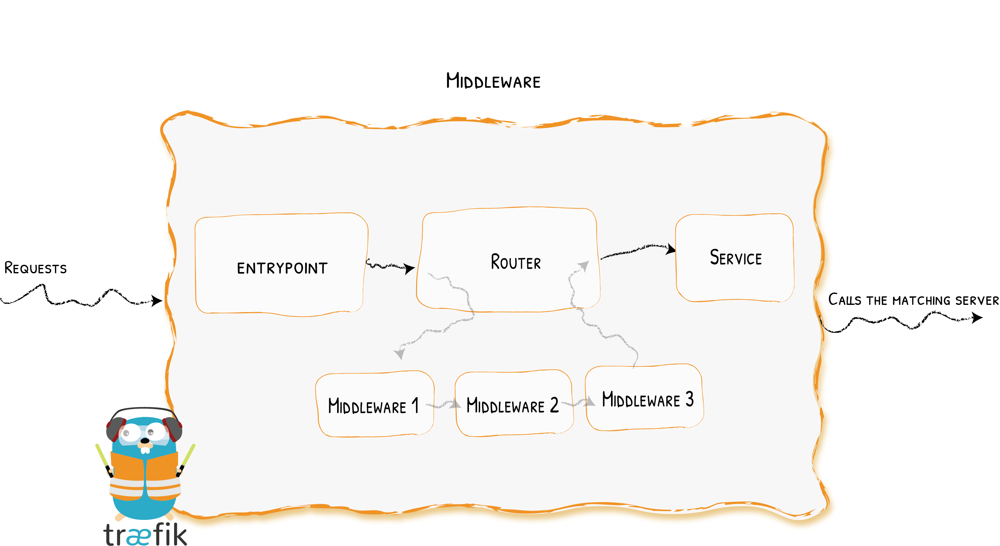

# Introduction

In this article, we're going to understand "**Traefik Proxy**" — the cloud native application proxy. 

Traefik Proxy reduces networking complexity when designing, deploying, and running applications.

Let's get to it with the simple question —

# What is Traefik?

Traefik is a leading modern reverse proxy and load balancer that makes deploying microservices easy. Traefik integrates with your existing infrastructure components and configures itself automatically and dynamically.

Traefik is designed to be as simple as possible to operate, but capable of handling large, highly-complex deployments across a wide range of environments and protocols in public, private, and hybrid clouds. It also comes with a powerful set of middlewares that enhance its capabilities to include load balancing, API gateway, orchestrator ingress, as well as east-west service communication and more.

## Architecture Overview

Traefik intercepts and routes every incoming request to the corresponding backend services.

Unlike a traditional, statically configured reverse proxy, Traefik uses service discovery to configure itself dynamically from the services themselves. All major protocols are supported and can be flexibly managed with a rich set of configurable middlewares for load balancing, rate-limiting, circuit-breakers, mirroring, authentication, and more.

Traefik also supports SSL termination and can be used with an ACME provider (like Let’s Encrypt) for automatic certificate generation.

Traefik’s extensive features and capabilities stack up to make it the comprehensive gateway to all of your applications.

# How it Works?

Let's zoom in on Traefik's architecture and talk about the components that enable the routes to be created.

First, when you start Traefik, you define entrypoints (in their most basic forms, they are port numbers). Then, connected to these entrypoints, routers analyze the incoming requests to see if they match a set of rules. If they do, the router might transform the request using pieces of middleware before forwarding them to your services.

## Responsibilities

### Providers

📑 Providers discover the services that live on your infrastructure (their IP, health, ...) & configuration discovery in Traefik is achieved through Providers.

The providers are infrastructure components, whether orchestrators, container engines, cloud providers, or key-value stores. The idea is that Traefik queries the provider APIs in order to find relevant information about routing, and when Traefik detects a change, it dynamically updates the routes.

### Entrypoints

📑 Entrypoint listen for incoming traffic (ports, ...) & opening connections for Incoming Requests

EntryPoints are the network entry points into Traefik. They define the port which will receive the packets, and whether to listen for TCP or UDP.

### Routers

📑 Routes analyse the requests (host, path, headers, SSL, ...) & connecting Requests to Services

A router is in charge of connecting incoming requests to the services that can handle them. In the process, routers may use pieces of middleware to update the request, or act before forwarding the request to the service.

### Services 

📑 Services forward the request to your services (load balancing, ...) & configuring How to Reach the Services

The Services are responsible for configuring how to reach the actual services that will eventually handle the incoming requests.

### Middlewares

📑 Middlewares may update the request or make decisions based on the request (authentication, rate limiting, headers, ...) & tweaking the Request

Attached to the routers, pieces of middleware are a means of tweaking the requests before they are sent to your service (or before the answer from the services are sent to the clients).

There are several available middleware in Traefik, some can modify the request, the headers, some are in charge of redirections, some add authentication, and so on.

Middlewares that use the same protocol can be combined into chains to fit every scenario.

# Summary

Almost all of the information from Traefik's official documentation has been incorporated into this article. In forthcoming blogs, I'll go through how to configure it with Dockerfile and Docker Compose.

After reading this article, you will have a fundamental grasp of the terminology and architecture utilised in Traefik.

- - -
