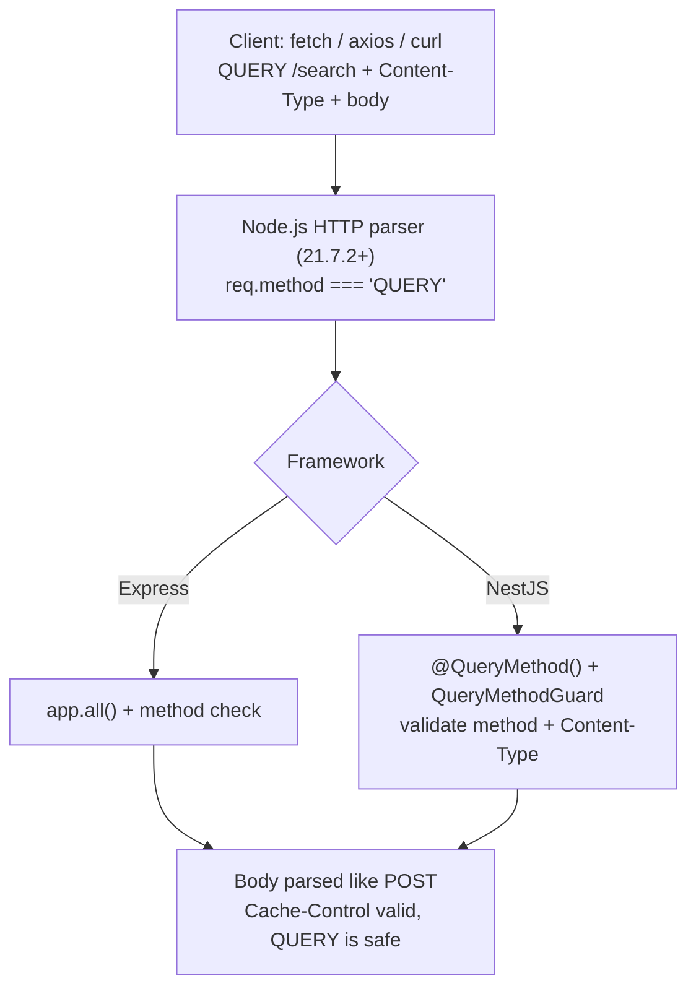

If you have ever built a search or filter endpoint, you have made this uncomfortable
choice. Use GET, and your complex filter object has to be crammed into the URL. Use
POST, and you are using a method that means "create or change something" for a request
that changes nothing.

That dilemma is over a decade old. In June 2026 the IETF finally closed it by publishing
[RFC 10008](https://www.rfc-editor.org/info/rfc10008/), which standardizes a new HTTP
method: `QUERY`. In one line, it is GET with a body, done properly.

## What QUERY actually is

Per RFC 10008, a `QUERY` request asks the target resource to process the enclosed
content in a safe and idempotent manner and respond with the result. You send a request
body describing what you want, and the server returns matching results without changing
any state.

That last part is the whole point. `QUERY` is the only HTTP method that combines a
request body with safe, idempotent, and cacheable semantics:

| Property | QUERY | What it means |
| --- | --- | --- |
| Safe | Yes | Does not modify server state |
| Idempotent | Yes | Can be retried safely after a failure |
| Cacheable | Yes | Responses can be cached, unlike POST |
| Has a body | Yes | The query definition lives in the request body |
| Content-Type | Required | The server MUST reject the request if it is missing |

## Why it had to exist

The gap it fills is precise:

- **GET** is safe and idempotent, but has no defined body semantics. Sending a body with
  GET is undefined behaviour, and many clients and proxies actively strip or reject it.
- **POST** carries a body, but is neither safe nor idempotent, so caches and
  intermediaries cannot optimize it and clients cannot safely retry it.
- **Complex queries** (GraphQL, JSONPath, structured search filters, large payloads) do
  not fit in a URL. You need a body. But you also want the request to be cacheable and
  retriable.

`QUERY` sits exactly in that gap. Here is how it compares to the methods you already
use:

| Method | Has body | Safe | Idempotent | Cacheable | Primary intent |
| --- | --- | --- | --- | --- | --- |
| GET | No (undefined) | Yes | Yes | Yes | Retrieve by URL |
| QUERY | Yes | Yes | Yes | Yes | Retrieve with a complex body |
| POST | Yes | No | No | No | Create or trigger an action |
| PUT | Yes | No | Yes | No | Replace a resource |
| PATCH | Yes | No | No | No | Partial update |
| DELETE | No | No | Yes | No | Remove a resource |

If you have been weighing [REST against gRPC](/grpc-vs-rest) for read-heavy services,
this narrows the case where REST felt clumsy: the complex read.

## Compatibility, as it really stands

This is where the AI-generated explainers floating around get sloppy, so be precise.
Native `QUERY` parsing first shipped in **Node.js 21.7.2** via the llhttp 9.2 update.
The very early 21.7.x releases had HTTP-parser rough edges, so treat the **22.x LTS line
and newer** as the reliable baseline. I confirmed it directly: on current Node a `QUERY`
request arrives with `req.method === 'QUERY'` and the body intact, no flags or shims.

| Layer | Status | Notes |
| --- | --- | --- |
| Node.js 22 LTS and newer | Supported | `QUERY` recognized natively; `req.method` is `'QUERY'` |
| Node.js 21.7.2 to 21.x | First support | Arrived with llhttp 9.2; early parser fixes followed |
| Node.js before 21.7.2 | Not recognized | The parser predates QUERY and rejects it |
| Express | Partial | No `app.query()` shorthand; use an `app.all()` guard |
| NestJS | No native support | `@Query()` already means URL params; a custom decorator is needed |
| fetch / axios | Works | `QUERY` is not a forbidden method, so both accept it |
| CORS | Preflight | `QUERY` is not on the safelist (GET/HEAD/POST), so cross-origin calls preflight |

Check your runtime with `node -v` before you write a line of code.

## Part 1: plain Node.js

Because `QUERY` is a recognized method, the server side needs no tricks. `req.method` is
simply `'QUERY'`, and body handling is identical to POST: collect chunks, concatenate,
parse.

```js
// server.js
const http = require('node:http');

const server = http.createServer((req, res) => {
  if (req.method === 'QUERY' && req.url === '/search') {
    let rawBody = '';
    req.on('data', (chunk) => { rawBody += chunk.toString(); });

    req.on('end', () => {
      // RFC 10008: the server MUST reject a QUERY with no Content-Type
      if (!req.headers['content-type']) {
        res.writeHead(400, { 'Content-Type': 'application/json' });
        res.end(JSON.stringify({ error: 'Content-Type is required for QUERY' }));
        return;
      }

      let queryBody;
      try {
        queryBody = JSON.parse(rawBody);
      } catch {
        res.writeHead(400, { 'Content-Type': 'application/json' });
        res.end(JSON.stringify({ error: 'Invalid JSON body' }));
        return;
      }

      const results = performSearch(queryBody);

      // QUERY is safe and idempotent, so caching the response is valid
      res.writeHead(200, {
        'Content-Type': 'application/json',
        'Cache-Control': 'max-age=60',
        'Accept-Query': 'application/json',
      });
      res.end(JSON.stringify({ results }));
    });
  } else {
    res.writeHead(405, { 'Content-Type': 'application/json' });
    res.end(JSON.stringify({ error: 'Method Not Allowed' }));
  }
});

function performSearch(body) {
  const { filter, limit = 10 } = body;
  return { filter, limit, items: ['item1', 'item2'] };
}

server.listen(3000, () => console.log('Server on http://localhost:3000'));
```

The client side is just as plain. `fetch` accepts any method string:

```js
// client.js
const response = await fetch('http://localhost:3000/search', {
  method: 'QUERY',
  headers: { 'Content-Type': 'application/json' }, // required per RFC 10008
  body: JSON.stringify({
    filter: { category: 'electronics', inStock: true },
    sort: '-price',
    limit: 20,
  }),
});

const data = await response.json();
```

Axios has no `.query()` shorthand yet, so use the generic config form:
`axios({ method: 'QUERY', url, headers, data })`. And to test from the shell:

```bash
curl -i -X QUERY http://localhost:3000/search \
  -H "Content-Type: application/json" \
  -d '{"filter": {"category": "electronics"}, "limit": 5}'
```

## Part 2: Express

Express has no `app.query()` because that name is already taken for reading URL query
params. The workaround is `app.all()` with a method guard inside:

```js
// express-server.js
const express = require('express');
const app = express();
app.use(express.json());

app.all('/search', (req, res) => {
  if (req.method !== 'QUERY') {
    return res.status(405).json({ error: 'Method Not Allowed' });
  }
  if (!req.headers['content-type']) {
    return res.status(400).json({ error: 'Content-Type is required' });
  }

  const { filter, limit = 10 } = req.body;
  res.setHeader('Cache-Control', 'max-age=60');
  res.setHeader('Accept-Query', 'application/json');
  return res.status(200).json({ results: { filter, limit, items: ['item1', 'item2'] } });
});

app.listen(3000, () => console.log('Express on port 3000'));
```

If you have several `QUERY` routes, wrap the guard in a small helper so the noise lives
in one place:

```js
function queryRoute(app, path, handler) {
  app.all(path, (req, res, next) => {
    if (req.method === 'QUERY') return handler(req, res, next);
    next();
  });
}
```

## Part 3: NestJS, wired up properly

NestJS is the interesting one. There is no `@QueryMethod()` decorator, and there cannot
be a `@Query()` one, because `@Query()` already reads URL query params. So you build it:
a custom route decorator plus a guard that enforces the method and validates
`Content-Type`. This is the same kind of plumbing I leaned on building the
[NestJS microservice with RabbitMQ and PostgreSQL](/microservices-in-nestjs-with-rabbitmq-postgresql).

**The decorator** marks a route as QUERY-only and registers it for all methods, leaving
the filtering to the guard:

```ts
// decorators/query-method.decorator.ts
import { All, applyDecorators, SetMetadata } from '@nestjs/common';

export const IS_QUERY_ROUTE = 'IS_QUERY_ROUTE';

export function QueryMethod(path?: string): MethodDecorator {
  return applyDecorators(
    SetMetadata(IS_QUERY_ROUTE, true),
    All(path),
  );
}
```

**The guard** rejects anything that is not `QUERY`, and enforces the Content-Type rule
from the spec:

```ts
// guards/query-method.guard.ts
import {
  CanActivate, ExecutionContext, Injectable,
  MethodNotAllowedException, BadRequestException,
} from '@nestjs/common';
import { Reflector } from '@nestjs/core';
import { IS_QUERY_ROUTE } from '../decorators/query-method.decorator';

@Injectable()
export class QueryMethodGuard implements CanActivate {
  constructor(private reflector: Reflector) {}

  canActivate(context: ExecutionContext): boolean {
    const isQueryRoute = this.reflector.get<boolean>(
      IS_QUERY_ROUTE, context.getHandler(),
    );
    if (!isQueryRoute) return true;

    const request = context.switchToHttp().getRequest();
    if (request.method !== 'QUERY') {
      throw new MethodNotAllowedException('This endpoint only accepts QUERY');
    }
    if (!request.headers['content-type']) {
      throw new BadRequestException('Content-Type is required for QUERY');
    }
    return true;
  }
}
```

**A validated DTO**, so the body is type-checked like any other NestJS payload:

```ts
// search/dto/search-query.dto.ts
import { IsObject, IsOptional, IsNumber, IsString } from 'class-validator';

export class SearchQueryDto {
  @IsObject() @IsOptional()
  filter?: Record<string, unknown>;

  @IsString() @IsOptional()
  sort?: string;

  @IsNumber() @IsOptional()
  limit?: number;
}
```

**The controller** ties it together. Notice `@Body()` works exactly as it does for POST:

```ts
// search/search.controller.ts
import { Controller, Body, Res, UseGuards, HttpCode, HttpStatus } from '@nestjs/common';
import { Response } from 'express';
import { QueryMethod } from '../decorators/query-method.decorator';
import { QueryMethodGuard } from '../guards/query-method.guard';
import { SearchService } from './search.service';
import { SearchQueryDto } from './dto/search-query.dto';

@Controller('search')
@UseGuards(QueryMethodGuard)
export class SearchController {
  constructor(private readonly searchService: SearchService) {}

  @QueryMethod() // handles QUERY /search
  @HttpCode(HttpStatus.OK)
  async search(
    @Body() queryDto: SearchQueryDto,
    @Res({ passthrough: true }) res: Response,
  ) {
    const results = await this.searchService.search(queryDto);
    res.setHeader('Cache-Control', 'max-age=60');
    res.setHeader('Accept-Query', 'application/json');
    return { results };
  }
}
```

The service and module are ordinary NestJS. Two things not to forget. First, that DTO
only validates if a `ValidationPipe` is active
(`app.useGlobalPipes(new ValidationPipe())`); without it, the decorators are inert.
Second, add `QUERY` to your CORS config, or every cross-origin call will fail its
preflight:

```ts
app.enableCors({ methods: ['GET', 'POST', 'QUERY', 'PUT', 'PATCH', 'DELETE'] });
```

## The full request path



## Known gaps today

The spec is final, but the ecosystem is still catching up:

| Gap | What to do |
| --- | --- |
| Node before 21.7.2 | Upgrade. There is no parser-level workaround |
| NestJS has no decorator | Use the `@QueryMethod()` + guard pattern above |
| Express has no shorthand | `app.all()` with a method check, or the `queryRoute()` helper |
| CORS preflight | Add `QUERY` to your `allowedMethods` |
| Swagger / OpenAPI | No standard tooling yet; document it manually |
| Axios shorthand | None; use `axios({ method: 'QUERY', ... })` |

## Should you use it

If you have a search or filter endpoint that has been awkwardly living as a POST, `QUERY`
is the upgrade it was waiting for: a real body for complex filters, plus safe,
idempotent, cacheable semantics that POST could never give you. It pairs especially well
with cursor-based listing, so it is worth revisiting
[how you paginate those results](/offset-vs-cursor-vs-keyset-pagination) at the same time.

One honest caveat on the caching point. RFC 10008 requires a cache to key on the request
body, and most shared caches and CDNs do not do that yet. So treat cacheability as
something the method now *permits*, not something your existing CDN will do for you on
day one.

It is not a reason to rewrite every endpoint. GET by URL is still right for simple reads.
But for the complex read, the decade-long GET-versus-POST compromise finally has a clean
answer.

## References

Everything above was checked against primary sources, and the Node.js behaviour was
confirmed by running a real QUERY request, not taken on faith from a generated draft.

- [RFC 10008: The HTTP QUERY Method](https://www.rfc-editor.org/rfc/rfc10008.html), and its [summary page](https://www.rfc-editor.org/info/rfc10008/) at the RFC Editor
- [RFC 10008 on the IETF datatracker](https://datatracker.ietf.org/doc/rfc10008/)
- [Node.js issue #51562: Support for the QUERY method](https://github.com/nodejs/node/issues/51562)
- [Node.js 21.7.2 release notes](https://nodejs.org/en/blog/release/v21.7.2)
- [Express issue #5615: Support HTTP QUERY method](https://github.com/expressjs/express/issues/5615)
- [Fetch Standard: forbidden methods](https://fetch.spec.whatwg.org/)
- [MDN: Cross-Origin Resource Sharing (CORS)](https://developer.mozilla.org/en-US/docs/Web/HTTP/Guides/CORS)
