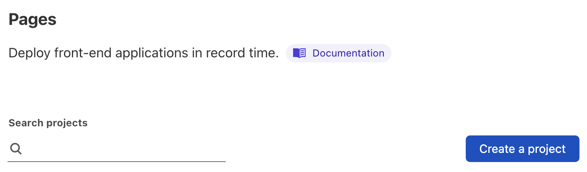
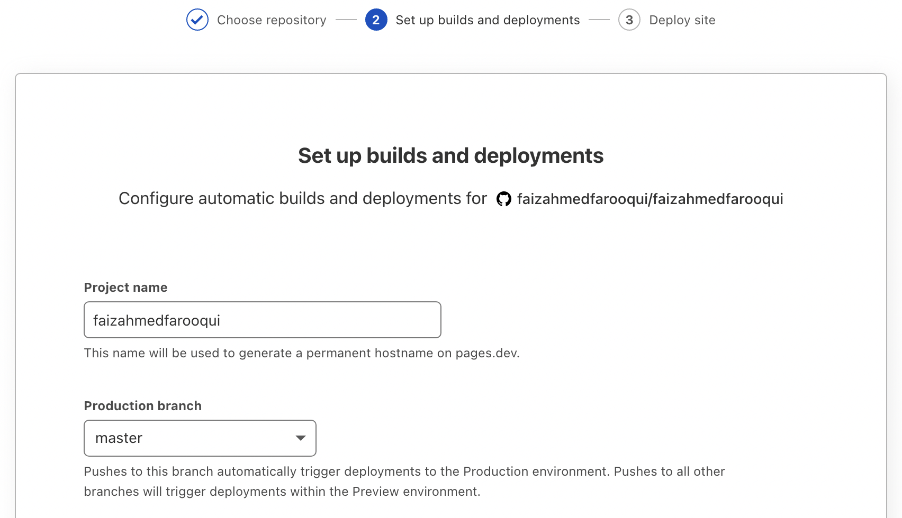
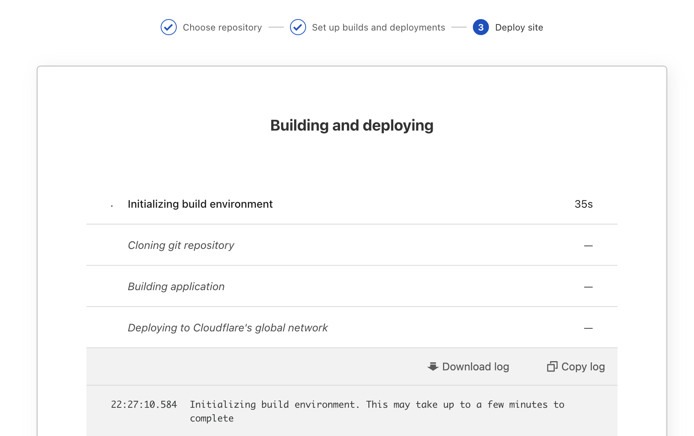
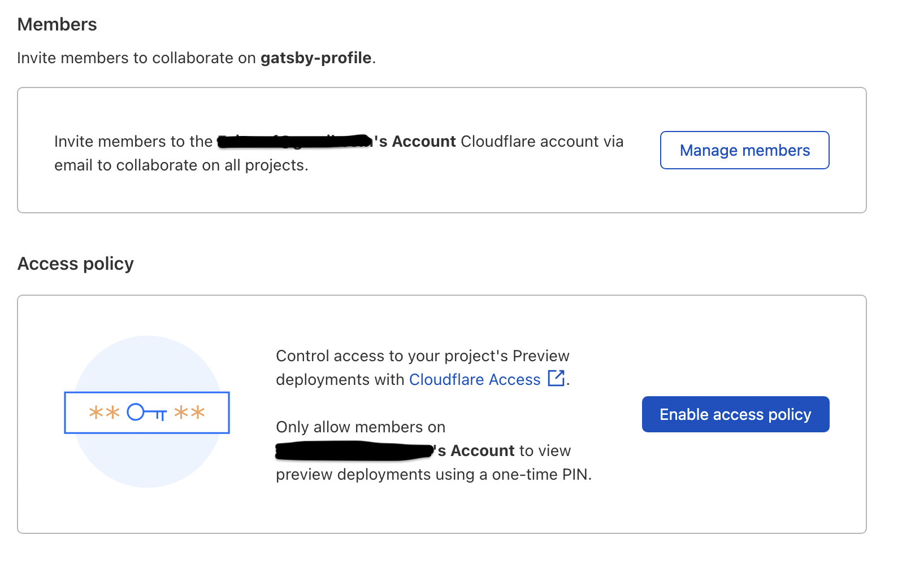

In December 2020,  [Cloudflare](http://cloudflare.com) announced the beta version & in April 2021, [Cloudflare Pages](https://pages.cloudflare.com/) was generally available. [Cloudflare Pages](https://pages.cloudflare.com/) a fast, secure, and free way for frontend developers to build, host, and collaborate on Jamstack sites.

# What is Cloudflare Pages?
Cloudflare Pages radically simplifies the process of developing and deploying sites by taking care of all the tedious parts of web development. Now, developers can focus on the fun and creative parts instead.

# Why Cloudflare Pages?

1. Built-in web analytics & for free
2. _redirects file support
3. Protected previews with Cloudflare Access integration
4. Live previews with Cloudflare Tunnel
5. Assets optimisation
6. Image compression
7. Brotli
8. Device-based resizing
9. GitHub support

# How?

- Goto  [Cloudflare Pages](https://pages.cloudflare.com/)
- Sign-up or Sign-in
- Find & click the "Create a Project" button
)
- Select the production branch
)
- Hit "Save & Deploy"
)
- We can invite others to collaborate or we can define the access policy to preview from the "Settings" tab

That's All. Thank You!

- - -
