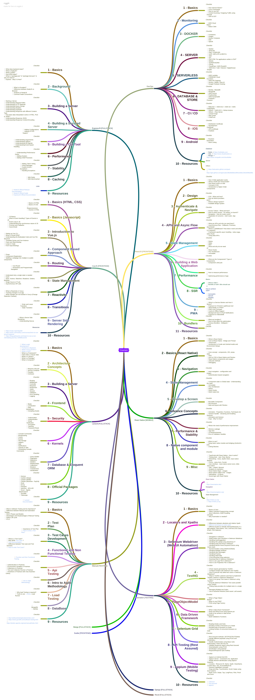

)” Trello board, find out the technology we want to learn & start reading the cards available for technology.

# How do we learn?

Each list contains features / important things as cards, and each of these cards contains checklists. Now, these checklists contain the list of items there is to know in the technology. If you can Google it on the Web, Et Voilà! You will find the answers.

# What we are offering right now?

1. DevOps — By [Rishabh Pandey](https://medium.com/@geekrishabh)
2. ExpressJS — By [Rajat Jainwal](https://medium.com/@rajatjainwal) & Me
3. ReactJS — By [Pranav Pandey](https://medium.com/@pranav_p)
4. VueJS — By Shrey Tiwari
5. React Native — By [Aditya Srivastava](https://medium.com/@aditya.srivastav2013)
6. Laravel — By Me
7. Django — By [Mukesh Chandra](https://medium.com/@alchemyguy)
8. Svelte — By [Mukesh Chandra](https://medium.com/@alchemyguy)
9. Automation Testing — By Biswajeet Gope
10. Manual Testing — By Biswajeet Gope

# What’s coming?

1. Beego — By [Rishabh Pandey](https://medium.com/@geekrishabh)
2. Revel — By [Rishabh Pandey](https://medium.com/@geekrishabh)

# Where to find the “What’s coming” list?

The list is available inside the Taxila team’s “[Courses](https://trello.com/b/ugOufjVK/courses)” Trello Board & the board is visible to the public. Please check out the board for live updates.

And since most of us are working from home right now and you get bored on weekends or at any time of the day, then this might help you to improve & pass the time.

And a huge shout-out to the guys for helping me out to complete the checklist. It wouldn't have been possible without them.

That's All!

- - -
