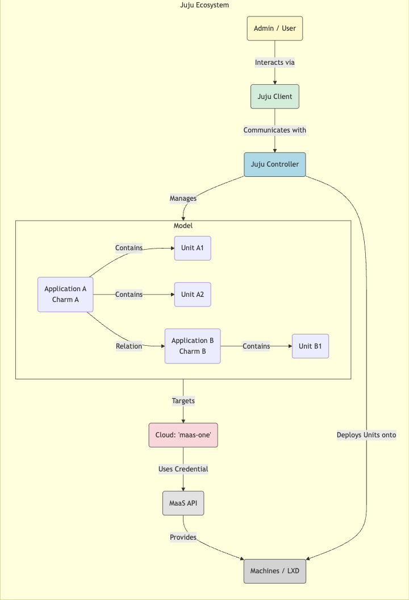

In Part 4, we successfully brought our physical servers ("metal") under MaaS control. They are commissioned, inventoried, and sitting in the "Ready" state, waiting for instructions.

Now, we need the conductor for our cloud orchestra – the tool that will intelligently deploy, configure, and connect all the complex services needed for OpenStack. Enter **Juju**.

## Why Juju? Taming Cloud Complexity 🤯

Deploying something like OpenStack involves dozens of interconnected services (databases, message queues, APIs for compute, network, storage, identity...). Managing this manually or with simple configuration management scripts (like Ansible playbooks or Salt states run sequentially) is fraught with peril:

* **Dependency Hell:** Getting the install and configuration order exactly right is complex.
    
* **Configuration Drift:** Manual changes or script inconsistencies lead to environments diverging over time.
    
* **Difficult Updates/Upgrades:** Upgrading components requires careful orchestration across services.
    
* **Scaling Challenges:** Adding capacity often involves complex reconfiguration.
    
* **Day 2 Nightmare:** Ongoing operations, monitoring, and troubleshooting become a significant burden.
    

Juju tackles this differently using **Model-Driven Operations**.

## Introducing Juju: Core Concepts 🧠

Instead of writing step-by-step procedural scripts, you tell Juju *what* you want your environment to look like (the "model"), and Juju works out how to make it happen and *keep* it that way using reusable components called Charms.

* **Controller:** The central Juju brain. It runs persistently (we'll deploy ours onto machine `i44`), manages different Models, and communicates with the underlying cloud (MaaS in our case).
    
* **Model:** An isolated workspace containing a set of applications and their relationships. We'll create an `openstack` model specifically for our cloud deployment. Models map to a specific cloud and credential.
    
* **Charm:** The magic component! ✨ A Charm contains the operational code and metadata needed to deploy, configure, integrate, scale, and upgrade a specific application (e.g., MySQL, Keystone, Ceph OSD). Charms are reusable pieces of operational expertise. You find them on [Charmhub.io](http://Charmhub.io).
    
* **Application:** An instance of a Charm deployed within a Model (e.g., our Keystone application will be an instance of the Keystone charm).
    
* **Unit:** A running instance of an Application, typically on a specific machine or container (e.g., if Keystone is deployed with 3 units for HA, each unit runs on a different machine/container).
    
* **Relation:** A defined connection between two Applications. Charms define what relations they support (e.g., Keystone offers an `identity-service` relation; Nova needs it). When you relate them (`juju integrate keystone nova-cloud-controller`), Juju automatically handles the configuration exchange (like passing database credentials, API endpoints, etc.).
    
* **Bundle:** A YAML file defining a complete model – multiple applications, their configurations, and their relations. Bundles allow deploying complex stacks like OpenStack with a single command (we'll likely use bundles later).
    



## Setting Up Our Juju Environment 🛠️

Let's get Juju ready to talk to our MaaS instance. These steps are typically done from your workstation or a dedicated management node.

1. **Install Juju Client:**
    
    ```bash
    sudo snap install juju --channel 3.1
    ```
    
    *(Snaps are a convenient way to install Juju and keep it updated.)*
    
2. **Add MaaS as a Juju Cloud:** We need to tell Juju about our MaaS API endpoint. Create a file named `maas-cloud.yaml` with content similar to this (replace `<IP_of_i41>`):
    
    ```yaml
    # maas-cloud.yaml
    clouds:
      maas-one: # Arbitrary name we choose for this cloud in Juju
        type: maas
        auth-types: [oauth1]
        endpoint: http://<IP_of_i41>:5240/MAAS/
    ```
    
    Then add it:
    
    ```bash
    juju add-cloud --client -f maas-cloud.yaml maas-one
    ```
    
3. **Add MaaS Credentials:** Juju needs an API key to authenticate with MaaS.
    
    * Go to your MaaS Web UI (`http://<IP_of_i41>:5240/MAAS/`).
        
    * Click your username (top right) -&gt; Account -&gt; MAAS keys -&gt; Add SSH key (add your public key if needed) -&gt; Generate API key.
        
    * Copy the generated API key.
        
    * Create a file named `maas-creds.yaml`:
        
        ```yaml
        # maas-creds.yaml
        credentials:
          maas-one: # Must match the cloud name
            anyuser: # Arbitrary credential name
              auth-types: [oauth1]
              maas-oauth: <PASTE_YOUR_MAAS_API_KEY_HERE>
        ```
        
    * Add the credentials:
        
        ```bash
        juju add-credential --client -f maas-creds.yaml maas-one
        ```
        

## Bootstrapping the Juju Controller 🚀

Now we create the Juju Controller itself. Juju will ask MaaS for a machine meeting specific criteria and deploy the controller software onto it. We've designated machine `i44` for this by tagging it appropriately in MaaS.

1. **Ensure MaaS Tag:** Make sure the machine intended for the controller (`i44` in our plan) has the MaaS tag `juju-controller` assigned to it in the MaaS UI (Machine -&gt; Configuration -&gt; Tags).
    
2. **Bootstrap Command:**
    
    ```bash
    juju bootstrap --bootstrap-series=jammy --constraints tags=juju-controller maas-one maas-controller
    ```
    
    * `--bootstrap-series=jammy`: Use Ubuntu 22.04 LTS for the controller's machine OS.
        
    * `--constraints tags=juju-controller`: Tell MaaS to use a machine with this specific tag.
        
    * `maas-one`: The Juju cloud name corresponding to our MaaS instance.
        
    * `maas-controller`: The name we're giving our Juju controller.
        
    
    This process will take several minutes. MaaS will allocate the machine (`i44`), deploy Ubuntu Jammy onto it, and then Juju will install the controller software inside that machine. You'll see progress updates in your terminal.
    
3. **Verify Controller:** Once finished, you can list controllers:
    
    ```bash
    juju controllers
    # You should see 'maas-controller' listed.
    ```
    
    Check the status:
    
    ```bash
    juju status -c maas-controller
    # Shows the controller model status, including the controller machine.
    ```
    

## Adding Our `openstack` Model 🏗️

With the controller running, we need a workspace (model) for our OpenStack deployment.

1. **Create the Model:**
    
    ```bash
    juju add-model --config default-series=jammy openstack
    ```
    
    * `openstack`: The name of our new model.
        
    * `--config default-series=jammy`: Sets Ubuntu 22.04 LTS as the default OS for *future* machines deployed *into this model*.
        
2. **Switch Context:** Tell the Juju client you want to work with this new model:
    
    ```bash
    juju switch maas-controller:openstack
    ```
    
    Your command prompt might change slightly to indicate the current controller:model context.
    

## Conclusion ✅

Success! We've installed the Juju client, configured it to talk to our MaaS instance, bootstrapped the Juju controller onto machine `i44` using MaaS, and created our dedicated `openstack` model.

Juju is now primed and ready. It knows how to request machines from MaaS and has a clean environment (`openstack` model) waiting for instructions.

In Part 6, we'll start giving it those instructions, using Juju to deploy the core components of the OpenStack control plane. The real cloud building begins now!
