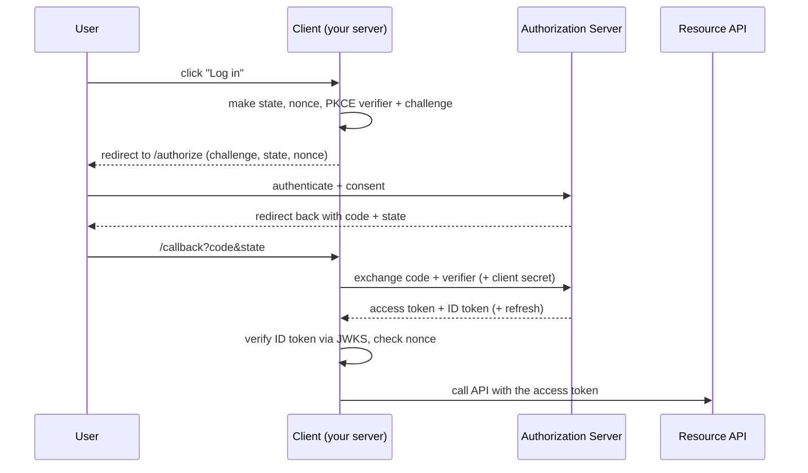
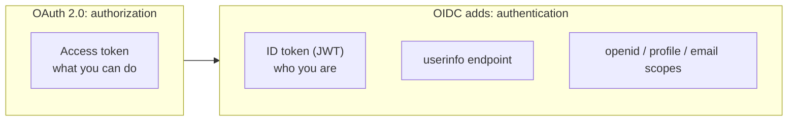

Here is the question OAuth was invented to answer: how do you let an app do something on
your behalf without handing it your password? You want a photo printing service to read
your Google Photos, but you do not want to give it your Google password. The answer is a
valet key, a credential that grants narrow, revocable access without being the master
key.

That is OAuth 2.0, and it is the source of the single most common misunderstanding in
this whole area. So before anything else: **OAuth 2.0 is authorization. OpenID Connect
(OIDC) is authentication.** OAuth gets an app *access*. OIDC tells the app *who you are*.
"Log in with Google" is OIDC, layered on top of OAuth. Get that distinction straight and
the rest stops being scary.

## The four roles

Every OAuth flow is a conversation between four parties:

- **Resource owner**: you, the human.
- **Client**: the application that wants access (here, your backend).
- **Authorization server**: issues tokens after you authenticate and consent (Google,
  Okta, Auth0, Keycloak).
- **Resource server**: the API that holds the protected data and accepts the token.

## The only flow you should use: Authorization Code with PKCE

There used to be several flows. Today there is effectively one for web apps: the
**Authorization Code flow**, hardened with **PKCE** (Proof Key for Code Exchange). The
draft OAuth 2.1 spec consolidates exactly this and retires the rest.



**Why PKCE:** the authorization code travels back through the user's browser, where it
can be intercepted. PKCE binds the code to a secret the client generates per request (the
*verifier*), so a stolen code is useless without it. It started as a mobile protection;
it is now recommended for every client, confidential ones included.

### Step 1: discovery and setup

OIDC providers publish their endpoints at a well-known URL, so you do not hardcode them:

```js
import crypto from 'node:crypto';
import { createRemoteJWKSet, jwtVerify } from 'jose';

const cfg = {
  issuer: 'https://accounts.example.com',
  clientId: process.env.OIDC_CLIENT_ID,
  clientSecret: process.env.OIDC_CLIENT_SECRET, // from a secret store, never hardcoded
  redirectUri: 'https://app.example.com/callback',
};

// Fetch the provider metadata once and cache it
const meta = await fetch(`${cfg.issuer}/.well-known/openid-configuration`).then((r) => r.json());

// JWKS for verifying ID-token signatures; the set auto-refreshes its keys
const JWKS = createRemoteJWKSet(new URL(meta.jwks_uri));
```

(Keeping the client secret in a secret store rather than the codebase is the same
discipline as [encrypting env with KMS](/encrypted-env-aws-kms-nodejs-complete-guide).)

### Step 2: start the login (the /authorize redirect)

```js
app.get('/login', (req, res) => {
  const state = crypto.randomBytes(16).toString('base64url');
  const nonce = crypto.randomBytes(16).toString('base64url');
  const codeVerifier = crypto.randomBytes(32).toString('base64url');
  const codeChallenge = crypto.createHash('sha256').update(codeVerifier).digest('base64url');

  // Stash these for the callback to check against
  req.session.oauth = { state, nonce, codeVerifier };

  const url = new URL(meta.authorization_endpoint);
  url.search = new URLSearchParams({
    response_type: 'code',
    client_id: cfg.clientId,
    redirect_uri: cfg.redirectUri,
    scope: 'openid profile email',          // 'openid' is what makes this OIDC
    state,                                   // CSRF protection on the redirect
    nonce,                                   // replay protection on the ID token
    code_challenge: codeChallenge,
    code_challenge_method: 'S256',
  }).toString();

  res.redirect(url.toString());
});
```

### Step 3: handle the callback (exchange code, verify ID token)

```js
app.get('/callback', async (req, res) => {
  const { code, state } = req.query;
  const saved = req.session.oauth;

  // The state must match what we sent, or this is a forged callback
  if (!saved || state !== saved.state) return res.status(400).send('Invalid state');

  // Exchange the code for tokens. PKCE verifier proves we started this flow.
  const tokenRes = await fetch(meta.token_endpoint, {
    method: 'POST',
    headers: { 'Content-Type': 'application/x-www-form-urlencoded' },
    body: new URLSearchParams({
      grant_type: 'authorization_code',
      code: String(code),
      redirect_uri: cfg.redirectUri,
      client_id: cfg.clientId,
      client_secret: cfg.clientSecret,       // confidential (server-side) client
      code_verifier: saved.codeVerifier,
    }),
  });
  const tokens = await tokenRes.json(); // { access_token, id_token, refresh_token, expires_in }

  // Verify the ID token: signature via JWKS, plus issuer and audience
  const { payload } = await jwtVerify(tokens.id_token, JWKS, {
    issuer: meta.issuer,
    audience: cfg.clientId,
  });

  // The nonce must match, or the ID token is being replayed
  if (payload.nonce !== saved.nonce) return res.status(400).send('Invalid nonce');

  // payload.sub is the stable, unique user ID at this provider
  req.session.user = { id: payload.sub, email: payload.email, name: payload.name };
  delete req.session.oauth;
  res.redirect('/');
});
```

That is a complete, correct login. The access token goes to APIs; the ID token told you
who logged in.

## The tokens, and the mistake everyone makes

Three tokens come out of that flow, and conflating them is the classic bug:

- **Access token**: "what you can do." Sent to the resource API. May be opaque or a JWT;
  the client should treat it as opaque and not parse it.
- **ID token**: "who you are." Always a JWT, meant for the *client*, verified via JWKS.
- **Refresh token**: used to get new access tokens without sending the user back through
  login.

The mistake: using the **access token** to identify the user. It was not issued for that,
its audience is the API, and it may carry no identity at all. Identity is the **ID
token's** job. Verifying that JWT signature is exactly the JWKS mechanism from
[the JWT/JWE/JWKS guide](/jwt-jwe-and-jwks-explained-a-developers-guide-to-token-based-security).

## OIDC is a thin identity layer on OAuth

OIDC does not replace OAuth; it adds an authentication layer to it.



The moment you add the `openid` scope, you get an ID token and the right to call the
`userinfo` endpoint. That is the entire substance of "Sign in with Google."

## Flows to retire

- **Implicit flow**: returned tokens directly in the redirect URL. Leaky, and now
  obsolete. Use Authorization Code + PKCE instead.
- **Resource Owner Password Credentials**: the app collects the user's actual password.
  This defeats the entire purpose of OAuth. Never use it.

## state and nonce are not optional

`state` ties the callback to the request you started, defeating CSRF on the redirect.
`nonce` ties the ID token to that same request, defeating
[token replay](/how-to-prevent-replay-attacks-with-jwts-jws-vs-jwe-and-fingerprint-validation-in-nodejs).
Skip them and you have a working demo with two real vulnerabilities.

## OAuth vs OIDC vs SAML

| | OAuth 2.0 | OIDC | SAML 2.0 |
| --- | --- | --- | --- |
| Purpose | Authorization (access) | Authentication (identity) | Authentication + SSO |
| Credential | Access token (opaque or JWT) | ID token (JWT) | XML assertion |
| Transport | Redirects + JSON | Redirects + JSON | XML over POST / redirect |
| Best for | API access delegation | App and consumer login | Enterprise SSO |
| Era | 2012 onward | 2014 onward | 2005 onward |

## After login: you still choose how to hold the session

OAuth and OIDC authenticate the user; they do not dictate how your app remembers them
afterward. You still pick [session versus token](/jwt-vs-paseto-vs-session-based-auth)
for your own app. And it closes a nice loop with the rest of this series: the
authentication the provider performs before redirecting back can itself be a
[passkey](/passkeys-webauthn-how-passwordless-login-works). OIDC federates the identity;
passkeys can be how that identity is proven in the first place.

OAuth is delegated access. OIDC is who you are. Hold those two apart and the spec, the
tokens, and the redirects all fall into place.

## References

The code targets the current `jose` library and Node's built-in `crypto`; OAuth 2.1 is
still a draft at the time of writing, so treat it as the direction of travel rather than a
finished RFC.

- [RFC 6749: The OAuth 2.0 Authorization Framework](https://www.rfc-editor.org/rfc/rfc6749)
- [RFC 7636: Proof Key for Code Exchange (PKCE)](https://www.rfc-editor.org/rfc/rfc7636)
- [OpenID Connect Core 1.0](https://openid.net/specs/openid-connect-core-1_0.html)
- [The OAuth 2.1 draft](https://datatracker.ietf.org/doc/draft-ietf-oauth-v2-1/)
- [jose (JWT/JWKS for JavaScript)](https://github.com/panva/jose)
