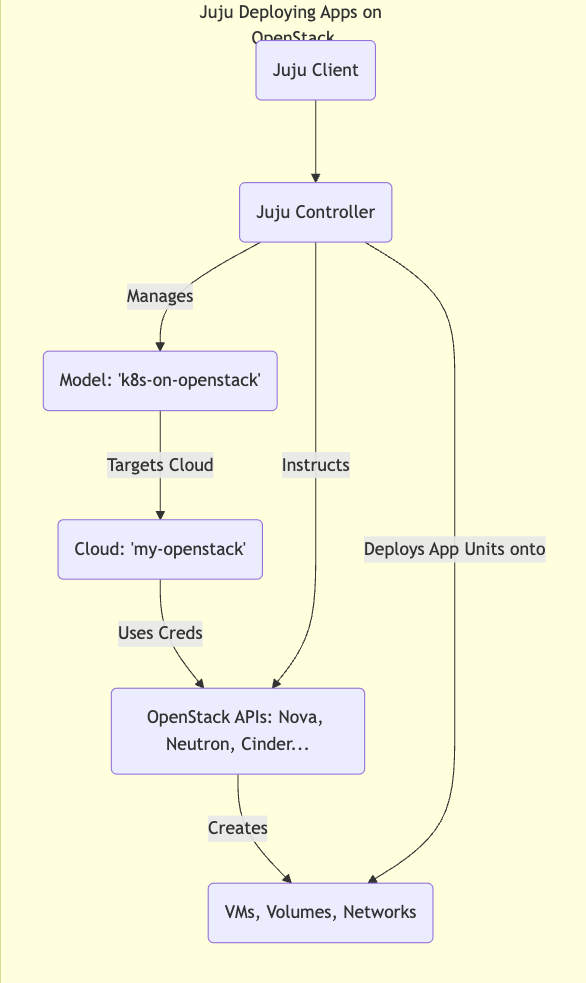

Welcome back!

In Part 12, we deployed the OpenStack Telemetry stack, giving us crucial visibility into our cloud's operation. We've built a robust IaaS platform complete with compute, storage (Ceph), networking (OVN), load balancing (Octavia), DNS (Designate), and monitoring.

Now it's time to demonstrate the *real* purpose of all this infrastructure: **running applications**.

One of the most powerful aspects of the ecosystem we've chosen is that **Juju**, the tool we used to orchestrate OpenStack itself, is equally adept at deploying and managing the applications that run *on* OpenStack (or any other cloud, for that matter).

## Juju Beyond Infrastructure: Application Orchestration 🚀

The same model-driven principles and reusable Charms apply:

* Define the application components (e.g., web server, database, cache).
    
* Define their configuration.
    
* Define the relationships between them.
    
* Tell Juju to deploy this model onto your target cloud (our OpenStack!).
    

Juju handles interacting with the cloud APIs (Nova, Cinder, Neutron) to provision the necessary VMs, volumes, and networks, and then deploys and configures the application components using their respective charms.

## Targeting Your OpenStack Cloud with Juju ☁️

Before deploying apps, we need to tell our Juju client how to connect to the OpenStack cloud we just built.

1. **Add OpenStack as a Juju Cloud:** Similar to adding MaaS, we define the cloud endpoint (Keystone URL). Create an `openstack-cloud.yaml` file:
    
    ```yaml
    # openstack-cloud.yaml
    clouds:
      my-openstack: # Choose a name for this cloud in Juju
        type: openstack
        auth-types: [userpass]
        # Use the Keystone VIP from our config.yaml
        endpoint: [http://10.3.1.203:5000/v3/](http://10.3.1.203:5000/v3/)
        regions:
          RegionOne: # Or your OpenStack region name
            endpoint: [http://10.3.1.203:5000/v3/](http://10.3.1.203:5000/v3/)
    ```
    
    Add the cloud:
    
    ```bash
    juju add-cloud --client -f openstack-cloud.yaml my-openstack
    ```
    
2. **Add OpenStack Credentials:** Generate credentials for Juju to use. You can use your admin user or, better practice, create a dedicated Juju user/project within OpenStack with appropriate permissions.
    
    ```bash
    # Add credentials interactively (replace placeholders)
    juju add-credential --client my-openstack
    # Enter credential name: my-openstack-creds
    # Select auth-type: userpass
    # Enter username: <your_openstack_username>
    # Enter password: <your_openstack_password>
    # Enter project domain name: Default
    # Enter user domain name: Default
    # Enter project name (tenant): <your_openstack_project_name>
    ```
    
3. **Create & Switch to an Application Model:** Create a new Juju model specifically for deploying applications onto OpenStack.
    
    ```bash
    # Use the controller bootstrapped earlier ('maas-controller')
    # Target the OpenStack cloud ('my-openstack') and use credentials
    juju add-model --cloud=my-openstack --credential=my-openstack-creds k8s-on-openstack
    # Switch context to the new model
    juju switch maas-controller:k8s-on-openstack
    ```
    
    Now, any `juju deploy` commands will target our OpenStack cloud.
    



## Example 1: Deploying Charmed Kubernetes on OpenStack ☸️

Let's deploy a full Kubernetes cluster. Canonical's Charmed Kubernetes makes this incredibly easy using Juju.

1. **Deploy the Bundle:** The `charmed-kubernetes` bundle includes charms for the Kubernetes control plane, workers, CNI (networking), CSI (storage integration with Cinder/Ceph), and more.
    
    ```bash
    # Deploy the bundle from Charmhub (specify a channel/revision for production)
    juju deploy charmed-kubernetes --channel=1.29/stable --trust
    # Add --overlay=ovn-overlay.yaml if specific OVN network config is needed
    # Add --config=k8s-config.yaml for custom settings (node sizes etc)
    ```
    
    * `--trust`: Allows the bundle to deploy charms that might require privileged operations (common for K8s).
        
2. **Watch Juju Work:** Juju will now:
    
    * Request multiple VMs from OpenStack (via Nova) for the control plane and workers.
        
    * Request persistent volumes (via Cinder/Ceph) if needed.
        
    * Configure networking (via Neutron/OVN) for the pods and services.
        
    * Deploy the Kubernetes components using their charms.
        
    * Automatically relate components like the CNI plugin, CSI driver, control plane, and workers.
        
3. **Monitor Status:**
    
    ```bash
    juju status --relations
    ```
    
    Watch as the units come up and relations are established. It will take some time!
    
4. **Access Your Cluster:** Once deployed, you can get the kubeconfig file:
    
    ```bash
    juju exec -u kubernetes-control-plane/leader -- cat /root/.kube/config > kubeconfig.yaml
    export KUBECONFIG=./kubeconfig.yaml
    kubectl cluster-info
    ```
    

You now have a fully functional Kubernetes cluster running on your private OpenStack cloud, deployed and managed by Juju!

## Example 2: Deploying a Multi-Tier Web App (WordPress) 🌐

Let's try a simpler, classic example: WordPress backed by MySQL.

1. **Create a New Model (Optional but good practice):**
    
    ```bash
    juju add-model --cloud=my-openstack --credential=my-openstack-creds wordpress-app
    juju switch maas-controller:wordpress-app
    ```
    
2. **Deploy Charms:** Deploy WordPress and a MySQL database (using the single-node `mysql` charm here for simplicity, could also use `mysql-innodb-cluster`).
    
    ```bash
    # Juju asks OpenStack for VMs for these units
    juju deploy mysql mysql-db
    juju deploy wordpress wordpress-site
    ```
    
3. **Integrate:** Tell Juju how the services relate.
    
    ```bash
    juju integrate wordpress-site:db mysql-db:db
    ```
    
    * Juju automatically passes the database connection details (address, user, password) from the `mysql-db` application to the `wordpress-site` application. WordPress configures itself!
        
4. **Expose WordPress:** Make the site accessible.
    
    ```bash
    juju expose wordpress-site
    ```
    
    Check `juju status wordpress-site` to find the public address. Juju might automatically associate an OpenStack Floating IP if the charm supports it and Floating IPs are available, or you might need additional steps/charms (like `neutron-gateway`) or manual Floating IP association. Alternatively, integrate with Octavia via appropriate charms/relations if you deployed it.
    

Access the IP address shown in `juju status` in your browser, and you should see the WordPress setup screen!

## Managing Application Lifecycle with Juju 🔄

Juju isn't just for deployment ("Day 1"). It excels at ongoing ("Day 2") operations for both infrastructure and applications:

* **Scaling:** Need more WordPress frontends or Kubernetes workers? Bash
    
    ```bash
    # Example: Scale WordPress to 3 units
    juju scale-application wordpress-site --units 3
    ```
    
* **Configuration:** Need to change an application setting? Bash
    
    ```bash
    # Example: Change WordPress blog title
    juju config wordpress-site blog_title="My Juju-Managed Blog"
    ```
    
* **Upgrades:** Need to upgrade Kubernetes or WordPress?
    
    ```bash
    # Example: Upgrade WordPress charm to a newer channel/revision
    juju upgrade-charm wordpress-site --channel latest/stable
    ```
    

Juju handles the underlying steps needed to perform these operations safely across potentially many units.

## Conclusion 🏆

This is the real power of the stack! We used Juju not only to stand up a complex OpenStack IaaS platform but also to deploy and manage applications *on* that platform, ranging from the complex (Kubernetes) to the common (WordPress).

The same model-driven approach, leveraging reusable charms, provides consistency and automation across the entire stack.

We've reached the peak of our initial build journey. In the final part, Part 14, we'll discuss essential Day 2 operations like monitoring in more detail, backups, scaling, upgrades, and wrap up the series.
