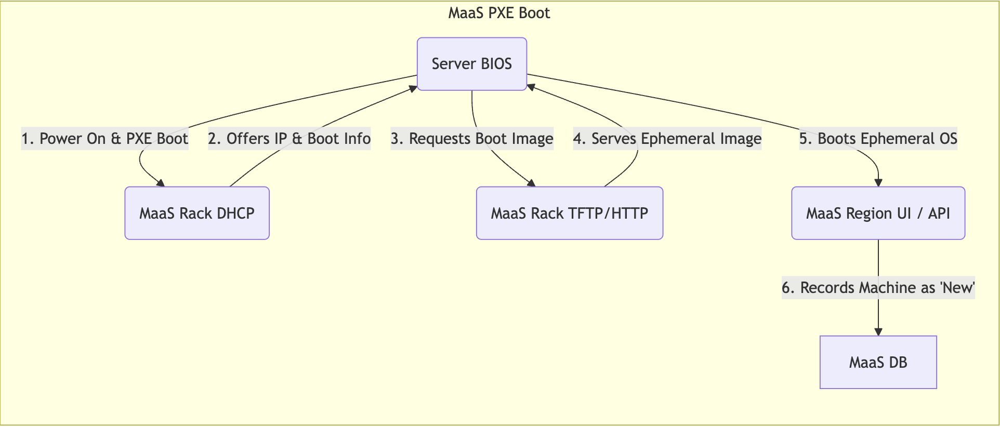

In Part 3, we successfully installed and configured our MaaS Region and Rack controllers (`i41`, `i42`, `i43`), imported Ubuntu images, and set up our network segments within MaaS.

The foundation is laid, but our physical servers are still "just hardware".

Now, it's time for the magic: getting MaaS to discover, inventory, test, and ultimately *manage* these servers. This is the **commissioning** process.

## Prerequisites: Preparing Your Servers 🔧

Before MaaS can even see your servers, they need some basic configuration:

1. **BMC / iDRAC Configuration:** This is absolutely crucial. MaaS *needs* to talk to each server's Baseboard Management Controller (BMC) over the network to manage power and get hardware details. Since we're using Dell servers, this means configuring the iDRAC:
    
    * **Network:** Assign a static IP address from our **MNT network (**`10.1.108.0/24`) to each server's iDRAC interface. Ensure it has the correct subnet mask and gateway (if needed for the MaaS controllers to reach it). *Do NOT use DHCP from MaaS for BMCs; use static IPs or DHCP reservations outside MaaS's dynamic range.*
        
    * **Credentials:** Set a strong, unique IPMI username and password on each iDRAC. You'll need these credentials later in MaaS. Record them securely!
        
    * **Enable IPMI over LAN:** Ensure this setting is enabled in the iDRAC settings.
        
2. **BIOS / UEFI Configuration:** We need to tell the server to boot from the network first so MaaS can take over during enlistment and commissioning.
    
    * **Boot Order:** Enter the server's BIOS/UEFI setup (usually by pressing F2, F10, F12, or Del during boot). Change the boot order to make **PXE Boot / Network Boot** the *first* priority, ahead of local disks or USB.
        
    * **Hardware Virtualization:** While you're in the BIOS, ensure hardware virtualization (Intel VT-x / AMD-V) is **Enabled**. OpenStack/KVM relies on this for performance.
        
    * **Other Settings:** Ensure integrated NICs are enabled, and potentially enable Wake-on-LAN (WoL) if you plan to use it via MaaS.
        

## MaaS Discovery & Enlistment: "Hello, MaaS!" 👋

Once a server is physically cabled (including its BMC/iDRAC port to the MNT network switch) and configured to PXE boot, simply power it on! Here's what happens:

1. The server attempts to PXE boot.
    
2. It sends a DHCP request on the network(s) configured for PXE (ideally including your MNT VLAN where a MaaS Rack Controller provides DHCP).
    
3. The MaaS Rack Controller (`i42` or `i43`) responds, assigning an IP address and telling the server where to download the MaaS **ephemeral boot image** (a minimal Ubuntu) via TFTP/HTTP.
    
4. The server downloads and boots this ephemeral image.
    
5. The booted image reports the server's basic details (MAC addresses, etc.) back to the MaaS Region Controller (`i41`).
    
6. Voila! The server appears in the MaaS Web UI under the "Machines" tab, typically in the **"New"** state. This process is called **Enlistment**.
    

## Commissioning: Getting to Know Your Hardware 🕵️‍♀️

A machine in the "New" state isn't ready for OS deployment yet. MaaS needs to learn about its capabilities. That's what **Commissioning** is for.

* **Why Commission?** During commissioning, MaaS boots the ephemeral image again and runs a series of scripts to:
    
    * **Inventory Hardware:** Detect CPU type/cores, RAM amount, disk drives (size, type, serial numbers), network interfaces (MAC addresses, speeds).
        
    * **Run Basic Tests:** Perform quick checks on CPU, memory, and disks to catch obvious hardware faults.
        
    * **Gather Firmware Info:** Record BIOS and BMC firmware versions.
        
    * **Prepare for Deployment:** Identify storage layout, network interfaces, etc., needed for automated OS installation later.
        
* **How to Commission:**
    
    1. Go to the "Machines" tab in the MaaS UI.
        
    2. Select one or more machines in the "New" state.
        
    3. Click the "Commission" button.
        
    4. **Crucially:** While it's commissioning (or just before), select the machine, go to its "Configuration" tab, find the "Power type" section.
        
        * Select the correct power type (e.g., "IPMI" or potentially newer options like "Redfish" if supported by MaaS and your iDRAC).
            
        * Enter the **BMC Address** (the static IP you assigned to the iDRAC on the MNT network).
            
        * Enter the **BMC Username and Password** you configured earlier.
            
        * Click "Save changes". MaaS needs this to verify power control and potentially power cycle the machine during the process.
            
    5. Monitor the progress in the UI. You'll see the machine's status change, and logs are available if issues occur.
        

## Ready State: Primed for Deployment ✅

If commissioning completes successfully, the machine's status changes to **"Ready"**. Congratulations! This server is now fully under MaaS control, inventoried, tested (basically), and available in the resource pool. You can see its detailed CPU, Memory, Storage, and Network information in the UI.

It's now waiting for its next instruction – typically allocation and deployment, which Juju will orchestrate later.

## Troubleshooting Common Issues 🤯

* **Machine Not Enlisting:**
    
    * Check BIOS boot order (PXE first?).
        
    * Verify network cabling (Is the correct NIC booting? Is the BMC cabled to MNT?).
        
    * Check MaaS DHCP configuration for the PXE VLAN (Is it enabled? Does the Rack Controller manage it? Are dynamic IPs available?).
        
    * Check switch port configuration (Is the VLAN configured correctly?).
        
* **Commissioning Fails:**
    
    * **Check BMC Credentials/IP in MaaS:** This is the most common issue. Double-check the IP address (on MNT network!) and credentials entered in the machine's Configuration tab in MaaS match the iDRAC settings *exactly*.
        
    * **Network Connectivity:** Can the MaaS Region/Rack controllers reach the BMC IP address on the MNT network? Check firewalls/routing if necessary.
        
    * **Hardware Issues:** Check the commissioning logs in the MaaS UI for specific hardware test failures (disk errors, memory errors).
        
    * **MaaS Version/Scripts:** Occasionally, very new hardware might need updated commissioning scripts (usually comes with MaaS updates).
        

## Next Steps

We've successfully configured our servers and used MaaS to discover, enlist, and commission them. Our bare metal is no longer just "tin" – it's an inventoried, ready pool of resources under automated control! 🎉

With MaaS managing the hardware foundation, we now need the orchestrator to build our cloud on top. In Part 5, we'll install and set up Juju, the maestro that will tell MaaS which machines to use and deploy our OpenStack services onto them.
