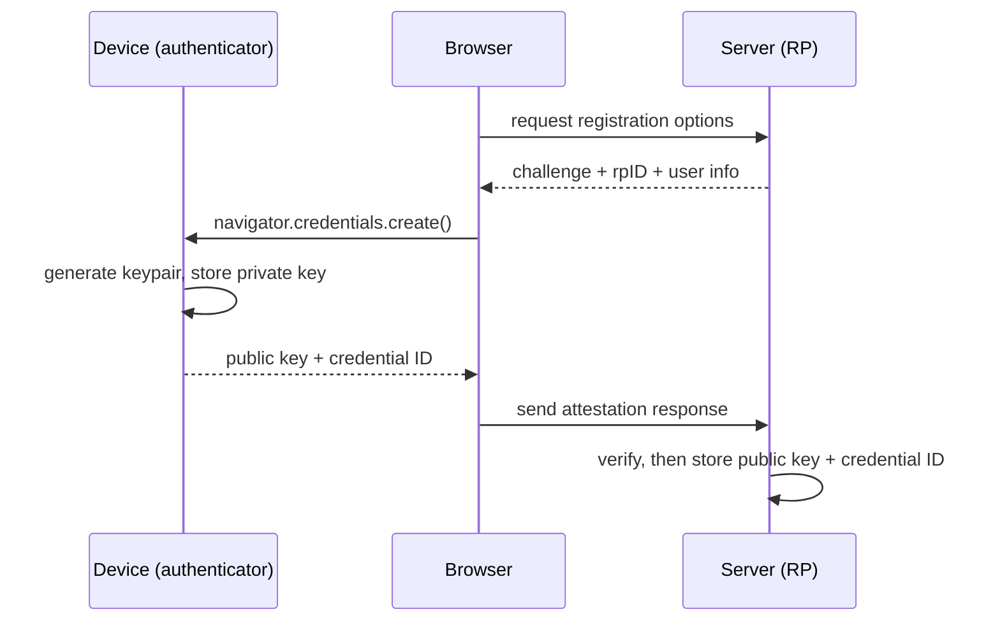
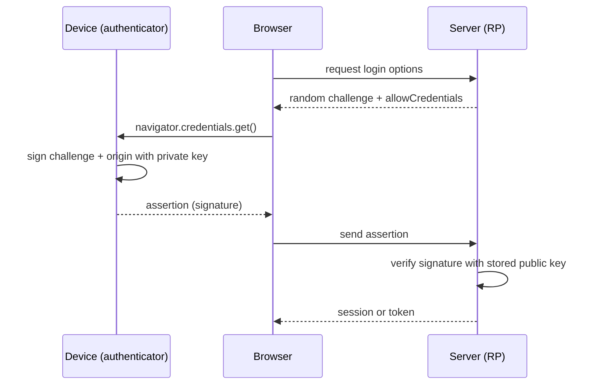

A password is a secret you and the server both know. That is the original sin of the
whole scheme: because the server has to store something to check your password against,
a breach of its database puts every account at risk, and because you type the same
secret into whatever page asks for it, a convincing fake page can simply collect it.

Passkeys remove the shared secret entirely. There is nothing in the server's database
worth stealing, and nothing a fake site can collect that would work anywhere else. That
sounds like magic until you see what is underneath, and then it is familiar: passkeys
are asymmetric [public-key cryptography](/symmetric-vs-asymmetric-encryption) and
[digital signatures](/how-digital-signatures-ensure-data-integrity), pointed at the
login box.

## The core idea: a keypair, not a secret

When you create a passkey, your device generates an asymmetric keypair. The **private
key never leaves the device** (it lives in the secure enclave, a TPM, or an encrypted,
synced keychain). The server only ever receives and stores the **public key**.

Compare that to a password. A password database stores a hash of a shared secret, and a
hash is still something an attacker can grind against offline once they have it. A
passkey database stores public keys, which are public by definition. There is no secret
on the server to leak. The contrast is the same one between
[hashing and encryption](/hashing-vs-encryption-whats-the-difference): with passkeys,
the sensitive half of the pair simply is not in the place that gets breached.

## Registration: creating the passkey

Registration is one round trip. The server hands the browser a set of options including
a random challenge; the authenticator generates the keypair and signs; the server stores
the returned public key.



In practice you do not hand-roll the WebAuthn byte parsing. On Node, the
[SimpleWebAuthn](https://simplewebauthn.dev/) library (v11+) wraps the ceremony. The
server side has two endpoints, options and verify:

```ts
import {
  generateRegistrationOptions,
  verifyRegistrationResponse,
} from '@simplewebauthn/server';

const rpName = 'Example App';
const rpID = 'example.com';            // the registrable domain
const origin = `https://${rpID}`;

// POST /webauthn/register/options
const options = await generateRegistrationOptions({
  rpName,
  rpID,
  userName: user.email,
  attestationType: 'none',
  // stop the user registering the same authenticator twice
  excludeCredentials: user.credentials.map((c) => ({ id: c.id, transports: c.transports })),
  authenticatorSelection: { residentKey: 'preferred', userVerification: 'preferred' },
});

await saveChallenge(user.id, options.challenge); // needed to verify the next request
return options;
```

```ts
// POST /webauthn/register/verify  (body = the browser's registration response)
const verification = await verifyRegistrationResponse({
  response: req.body,
  expectedChallenge: await getChallenge(user.id),
  expectedOrigin: origin,
  expectedRPID: rpID,
});

if (verification.verified && verification.registrationInfo) {
  const { credential, credentialDeviceType, credentialBackedUp } =
    verification.registrationInfo;

  await saveCredential(user.id, {
    id: credential.id,                                       // base64url string
    publicKey: Buffer.from(credential.publicKey).toString('base64url'),
    counter: credential.counter,
    transports: credential.transports,
    deviceType: credentialDeviceType,                        // 'singleDevice' | 'multiDevice'
    backedUp: credentialBackedUp,
  });
}
```

The browser half is tiny, because the authenticator and OS do the work:

```ts
import { startRegistration } from '@simplewebauthn/browser';

const optionsJSON = await fetch('/webauthn/register/options', { method: 'POST' })
  .then((r) => r.json());

const regResponse = await startRegistration({ optionsJSON });

await fetch('/webauthn/register/verify', {
  method: 'POST',
  headers: { 'Content-Type': 'application/json' },
  body: JSON.stringify(regResponse),
});
```

## Authentication: proving you hold the key

Login is the same shape, but now the device proves possession of the private key by
signing a fresh challenge. The server checks that signature against the public key it
stored at registration.



```ts
import {
  generateAuthenticationOptions,
  verifyAuthenticationResponse,
} from '@simplewebauthn/server';

// POST /webauthn/login/options
const options = await generateAuthenticationOptions({
  rpID,
  allowCredentials: user.credentials.map((c) => ({ id: c.id, transports: c.transports })),
  userVerification: 'preferred',
});
await saveChallenge(user.id, options.challenge);
return options;
```

```ts
// POST /webauthn/login/verify
const stored = await getCredentialById(req.body.id); // look up by credential ID

const verification = await verifyAuthenticationResponse({
  response: req.body,
  expectedChallenge: await getChallenge(user.id),
  expectedOrigin: origin,
  expectedRPID: rpID,
  credential: {
    id: stored.id,
    publicKey: Buffer.from(stored.publicKey, 'base64url'),
    counter: stored.counter,
    transports: stored.transports,
  },
});

if (verification.verified) {
  // bump the signature counter to catch cloned authenticators
  await updateCounter(stored.id, verification.authenticationInfo.newCounter);
  // only now do you establish a session or issue a token
}
```

Note that last comment. WebAuthn authenticates the user; it does not replace your
session layer. Once verified, you still decide
[session versus token](/jwt-vs-paseto-vs-session-based-auth) like any other login.

## Why this kills phishing

This is the part that matters, and it falls out of the design for free.

The signature the authenticator produces covers the **origin** of the site requesting
it, and the credential is bound to a specific relying-party ID. A passkey created for
`example.com` will not sign for `examp1e.com`. Even if a user is fooled into visiting a
perfect clone, the browser hands the authenticator the *attacker's* origin, the
signature is computed over that origin, and it will never verify against the real
server's stored key. There is no password to type into the wrong box.

Two more properties come along: the challenge is random and single-use, so a captured
assertion cannot be [replayed](/how-to-prevent-replay-attacks-with-jwts-jws-vs-jwe-and-fingerprint-validation-in-nodejs),
and because the server holds only a public key, a database dump hands an attacker
nothing they can log in with.

## Untangling the names

The terminology trips people up, so once, plainly:

- **WebAuthn** is the W3C browser API (`navigator.credentials`).
- **CTAP** is the protocol between the browser and an external authenticator.
- **FIDO2** is WebAuthn and CTAP together.
- **Passkeys** are WebAuthn credentials that are discoverable and usually synced across
  your devices through a platform keychain.

## Synced vs device-bound

Passkeys come in two flavours, and the difference is a real trade-off:

- **Synced passkeys** (iCloud Keychain, Google Password Manager, etc.) replicate the
  private key, end-to-end encrypted, across your devices. You get convenience and
  recovery if you lose a device. `credentialBackedUp` is true for these.
- **Device-bound passkeys** (a hardware security key) never leave the one device. Higher
  assurance, no sync, and losing the key means losing that credential.

Most consumer apps want synced passkeys for the user experience. High-assurance contexts
may require device-bound keys.

## Passwords vs MFA vs passkeys

| | Passwords | TOTP / SMS MFA | Passkeys |
| --- | --- | --- | --- |
| Shared secret on the server | Yes (a hash) | Yes (a seed) | No (public key only) |
| Phishing-resistant | No | No, codes can be relayed | Yes, origin-bound |
| Breach exposure | High | Medium | Minimal |
| Replayable | Yes | Within a time window | No, single-use challenge |
| User effort | Type and remember | Type plus a second step | Biometric or a tap |

## What the server actually stores

Per credential: the credential ID, the public key, a signature counter, and the
transports list. That is the entire footprint. No secret, nothing reversible, nothing
that is dangerous to leak. Passwordless is not a marketing word. It is asymmetric keys
and digital signatures, the primitives you already use, finally applied to the one place
that needed them most.

## References

The code above is written against the current `@simplewebauthn/server` (v11+) API, whose
`verifyAuthenticationResponse` takes a `credential` argument; older guides still show the
removed `authenticator` argument, so check the version before copying.

- [Web Authentication: An API for accessing Public Key Credentials (W3C)](https://www.w3.org/TR/webauthn-2/)
- [Passkeys (FIDO Alliance)](https://fidoalliance.org/passkeys/)
- [SimpleWebAuthn documentation](https://simplewebauthn.dev/docs/)
