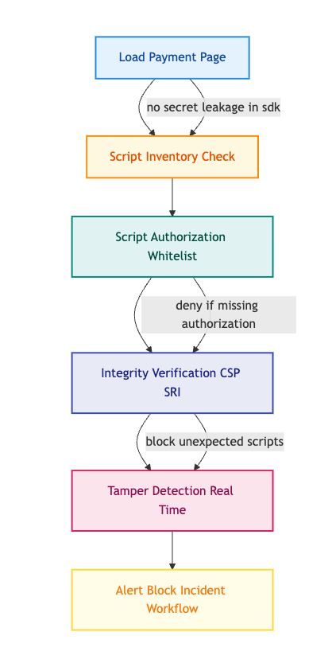

Payment form security has largely focused on backend systems, until now.

PCI DSS 4.0 draws much-needed attention to **client-side risks**, such as Magecart and script tampering.

In this post, you'll see why the front-end has become a battleground, what the new requirements demand, and how to implement them effectively using visuals and clear guidance.

## The New Client-Side Attack Landscape

Traditional server-only security controls are bypassed by attacks that inject malicious JavaScript into payment pages.

Hackers exploiting client-side scripts directly intercept users’ card data undetectable by most defenses.

This vulnerability is especially critical as it's the gateway for **Magecart-style attacks**.

## PCI DSS 4.0 Timeline: Why Now?

PCI DSS v3.2.1 officially retired on **March 31, 2024**, but organizations have until **March 31, 2025** to implement all the new v4.0 requirements, including client-side ones.

## Deep Dive: What Requirements 6.4.3 & 11.6.1 Actually Mean

### **Requirement 6.4.3 — Script Management**

All scripts executed in the browser on payment pages must be:

* **Authorized** (explicitly approved)
    
* **Integrity-verified** (e.g., using SRI or CSP)
    
* **Catalogued** in an inventory with valid business justification
    

### **Requirement 11.6.1 — Change/Tamper Detection**

Payment pages must be continuously monitored for unauthorized script or header changes. Any deviation must trigger alerts and incident processes.

## Visualizing Client-Side Protections

Here's a focused diagram that maps the sequence of protections needed around payment forms:

## Implementation Techniques & Tools

| **Control** | **How to Implement / Tooling** |
| --- | --- |
| **Script Inventory** | Maintain live registry with justification (e.g., Stripe.js, analytics) |
| **Authorization + Integrity** | Enforce CSP rules, use SRI hashes, and vet third-party code |
| **Tamper Detection** | Deploy monitoring solutions like Feroot, Imperva, Source Defense |

## Common Pitfalls (And How to Avoid Them)

* Statically defined inventories that aren't updated in real time
    
* Overly restrictive CSPs that break legitimate UX
    
* No alerting workflows or incident response when tampering occurs
    

## **Conclusion**

Securing the backend is no longer enough. PCI DSS 4.0 mandates strong frontend controls to guard against evolving threats like script skimming. Right tools, processes, and vigilance are now required to stay audit-ready and protect your users.
