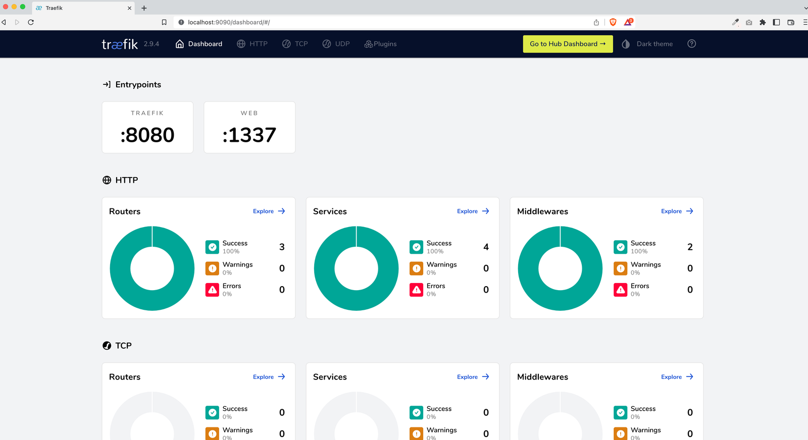
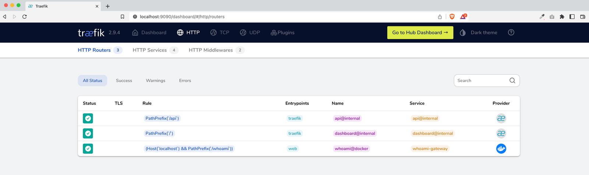
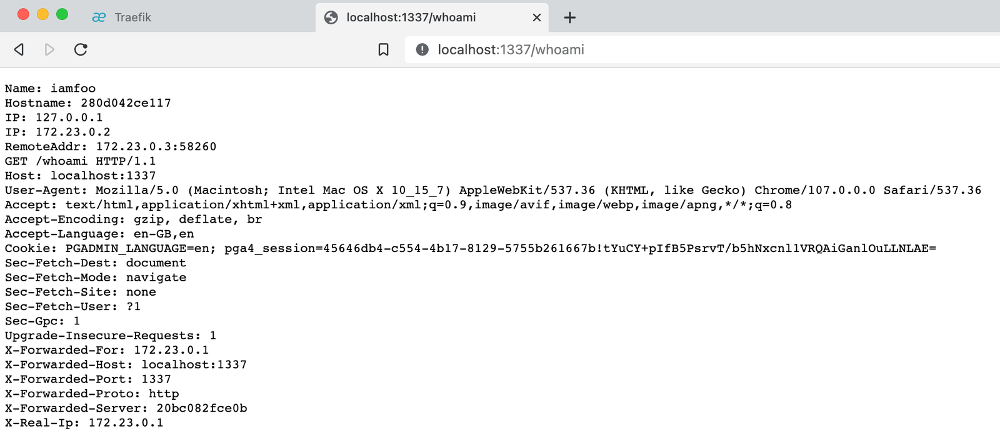

# Introduction

In this post, I'll show you how to install Traefik Proxy — the cloud native application proxy in our Docker Compose file and utilize it in our architecture with a sample service container.

Traefik Proxy was discussed in my previous post — [How much do you know "Traefik" proxy?](/how-much-do-you-know-traefik-proxy)

As a baseline, I'm assuming you're familiar with [Docker](https://docs.docker.com/desktop/) and [Docker Compose](https://docs.docker.com/compose/) files.

Let's get started —

# Docker Compose 

- Add the following content to your `docker-compose.yml` file

```yml
version: '3.6'

services:
  traefik:
    image: "traefik:v2.9"
    container_name: "traefik"
    command:
      - "--api.insecure=true"
      - "--providers.docker=true"
      - "--providers.docker.exposedbydefault=false"
      - "--log.level=debug"
      - "--entrypoints.web.address=:1337"
    ports:
      - "1337:1337"
      - "9090:8080"
    volumes:
      - "/var/run/docker.sock:/var/run/docker.sock:ro"

  whoami:
    image: "traefik/whoami"
    container_name: "iamfoo"
    command: "--port 80 --name iamfoo"
    labels:
      - "traefik.enable=true"
      - "traefik.http.routers.whoami.entrypoints=web"
      - "traefik.http.routers.whoami.rule=(Host(`localhost`) && PathPrefix(`/whoami`))"
```

# Details (of the content mentioned in Docker Compose file)

- Replace `localhost` with your own domain or sub-domain in service container `whoami`
- Run `docker-compose.yml` file by using the command `docker-compose up -d`
- Your server should be up and running. Visiting `http://localhost:1337/whoami`, will show you all request headers
- I'm using Traefik's [whoami](https://github.com/traefik/whoami) service as an example, it is a tiny Go server that prints os information and HTTP request to output

```yml
command:
  - "--entrypoints.web.address=:1337"

ports:
  - "1337:1337"
```

- The above mini snapshot shows how we define entry point in Traefik
- This allows us to "open and accept" HTTP traffic

```yml
command:
  - "--api.insecure=true"

ports:
  - "9090:8080"
```

- The above mini snapshot shows how we configure & expose Traefik's API and Dashboard.
- By default, Traefik will listen on port 8080 for API requests 
- This is a fully optional step; we may disable the Dashboard and secure APIs if you do not want to.

```yml
command:
  - "--log.level=debug"
```

- To enable and customise the log and it's level, we can use the command as mentioned above
- Accepted values, in order of severity - `DEBUG`, `INFO`, `WARN`, `ERROR`, `FATAL` & `PANIC`

```yml
traefik:
  command:
    "--providers.docker=true"
    "--providers.docker.exposedbydefault=false"
  volumes:
    - "/var/run/docker.sock:/var/run/docker.sock:ro"

whoami:
  ...
  labels:
    - "traefik.enable=true"
    - "traefik.http.routers.whoami.entrypoints=web"
    - "traefik.http.routers.whoami.rule=(Host(`localhost`) && PathPrefix(`/whoami`))"
```

- To enable docker as a providers for Traefik configuration, we set the value as **true** against `providers.docker`
- If we want to enable all the service containers within the **docker-compose** file, we can set the value as **true** against `providers.docker.exposedbydefault`
- But, I'd recommend to not expose all service containers unless really needed
- If choose to not explicitly expose all your service containers, then you'd need to enable each container service by setting `traefik.enable` as **true**
- To allow request only from your predefined entry point, we set `traefik.http.routes.whoami.entrypoint` with the name value we defined in our `traefik` service - in our case, it is **web**

# Screenshots

## Traefik Dashboard 



## Traefik Dashboard's Routers List



## Whoami Service Container



# Summary

After reading this article, you will have a fundamental grasp on how to setup Traefik Proxy in your Docker Compose with a service.

And I strongly advise everyone to have the "[traefik/whoami](https://hub.docker.com/r/traefik/whoami)" service container ready for debugging request headers if something goes wrong.

- - -
