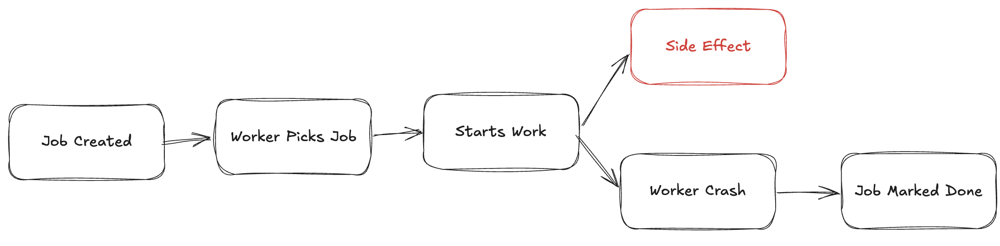

A few months ago, we had a system that was “working fine”.

Jobs were getting processed. Workers were running. No errors in logs.

But users started complaining.

Some notifications were never sent.

Not delayed. Not failed.

Just… missing.

That’s when we realized something:

Our background jobs weren’t failing.

They were lying.

### The actual failure

The bug looked like this:

*   Job picked by worker
    
*   External API call started
    
*   Worker crashed (OOM / deploy / network)
    
*   Job was already marked as “completed”
    

From the system’s perspective:

> everything succeeded

From reality:

> nothing happened

No retry.  
No error.  
No signal.

Just lost work.

### Why this happens

Most queue systems don’t guarantee execution.

They guarantee **delivery**, not **completion**.

That’s a big difference.

If your logic looks like:

*   pick job
    
*   do work
    
*   mark done
    

You are already vulnerable.

Because crashes don’t follow your control flow.

### The mental model shift

Stop thinking:

> “Did the job run?”

Start thinking:

> “Did the side effect happen?”

That’s the only thing that matters.

### Concrete example (The Pain)

Let’s say:

*   You send an email
    
*   Or trigger a payment
    
*   Or update a ledger
    

If your job runs twice → problem  
If your job runs zero times → bigger problem



> We said “done” too early, and the crash made that a lie.

And both happen more often than people think.

### The real fixes (not checklist, but logic)

#### 1\. Move “done” after verification

Don’t mark jobs complete when work *starts*  
Mark them complete when outcome is *confirmed*

#### 2\. Idempotency is not optional

If retry breaks your system, your system is already broken.

Example:

*   Store operation keys
    
*   Deduplicate by business ID
    
*   Make side effects safe to repeat
    

#### 3\. Separate “processing” from “commit”

This is where most people mess up.

Instead of:

*   process → done
    

Do:

*   process → verify → commit
    

#### 4\. Accept that jobs will run multiple times

Design for it.

Don’t try to prevent it.

### NestJS angle

If you’re using NestJS + Bull:

The default pattern most people write is this:

```typescript
@Process()
async handle(job: Job) {
  await this.sendEmail(job.data)
}
```

This is unsafe.

A better version:

```typescript
@Process()
async handle(job: Job) {
  const exists = await this.repo.find(job.id)
  if (exists) return

  const result = await this.sendEmail(job.data)

  await this.repo.save({
    jobId: job.id,
    status: 'completed',
    result
  })
}
```

Now:

*   retries are safe
    
*   crashes don’t corrupt state
    

### The uncomfortable truth

If your background job system looks “clean” and “simple”

You probably haven’t seen it fail yet.

Because when it does, it won’t throw errors.

It will just silently stop doing what you think it’s doing.

### Closing line

Failures in APIs are loud.  
Failures in background jobs are silent.

That’s why they are dangerous.
